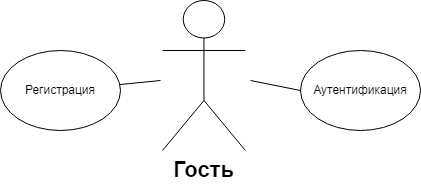
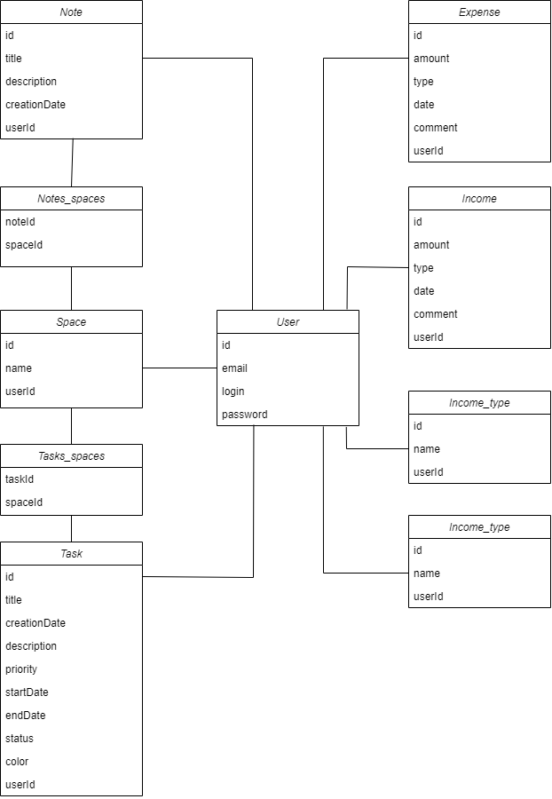
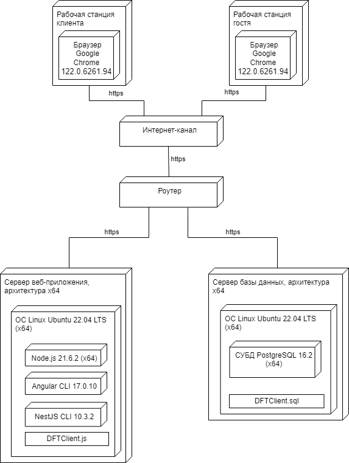

### DIARY AND FINANCES TRACKER WEB-APP

This is diploma work, which has Angular on front, NestJS on back and PostgreSQL in docker container as database.

[Watch description video](https://rawcdn.githack.com/EgorSasim/diary-finances-tracker-app/5c9c189a664ea84692dec4a8b03f33429c0bdfca/reports/videoReport-2024-06-09_20.22.40.mp4)

### Start the application
To launch this application U need:
1. npm
2. angular CLI
3. nestJS CLI
4. docker

Upload front part [here](https://github.com/EgorSasim/diary-finances-tracker-front)
back part [here](https://github.com/EgorSasim/diary-finances-tracker-server)
and database part [here](https://github.com/EgorSasim/diary-finances-tracker-database)

!!!dont' forget to write `npm install` after loading front and back part is completed.

after that go to the root foler of whole application.

write `npm install`

after that write `npm run start` to launch application (don't forget to launch docker before write this command).

Congratulations!!! Now U can see the app on localhost:4200

### P.S.
The app automatically create an account with test data

login: val

password: 11

### P.P.S. 
U may need to install appropriate container with database before launch whole application from root foler.

To do that just navigate to diary-finances-tracker-database folder and run .sh script. It will automatically load necessary container with PostgreSQL database.

Good luck)

# **СОДЕРЖАНИЕ**
[Введение	7](#_toc167074957)

[1	Анализ прототипов, литературных источников и формирование требований к проектируемому программному средству	8](#_toc167074958)

[1.1	Анализ предметной области	8](#_toc167074959)

[1.2	Анализ существующих аналогов	8](#_toc167074960)

[1.3	Формирование технического задания клиент-серверного приложения	13](#_toc167074961)

[2	Анализ требований к программному средству и разработка спецификации функциональных требований	15](#_toc167074962)

[2.1	Описание функциональности клиент-серверного приложения	15](#_toc167074963)

[2.2	Спецификация функциональных требований	17](#_toc167074964)

[2.3	Инфологическая модель базы данных веб-приложения	20](#_toc167074965)

[2.4	Выбор языка и инструментов разработки	24](#_toc167074966)

[3	Проектирование программного средства	26](#_toc167074967)

[3.1	Разработка архитектуры приложения	26](#_toc167074968)

[3.2	Проектирование даталогической модели базы данных	29](#_toc167074969)

[3.3	Разработка алгоритма приложения и алгоритмов отдельных модулей	33](#_toc167074970)

[4	Разработка программного средства	38](#_toc167074971)

[4.1	Разработка API и моделей передачи данных между клиентом и сервером	38](#_toc167074972)

[4.2	Разработка ORM-моделей приложения	39](#_toc167074973)

[4.3	Разработка валидации данных	41](#_toc167074974)

[4.4	Разработка механизма динамической смены языков	43](#_toc167074975)

[4.5	Разработка механизма динамической смены цветовых тем приложения	44](#_toc167074976)

[5	Тестирование программного средства	47](#_toc167074977)

[6	Руководство по установке и использованию	57](#_toc167074978)

[6.1	Установка программного средства	57](#_toc167074979)

[6.2	Руководство пользователя	57](#_toc167074980)

[7	Технико-экономическое обоснование эффективности разработки и реализации на рынке веб-приложения «ежедневник и финансовый трекер»	65](#_toc167074981)

[7.1	Расчет инвестиций на разработку веб-приложения	65](#_toc167074982)

[7.2	Расчет экономического эффекта от реализации проекта	68](#_toc167074983)

[7.3	Расчет показателей экономической эффективности разработки и реализации веб-приложения на рынке	69](#_toc167074984)

[7.4	Вывод по технико-экономическому обоснованию	70](#_toc167074985)

[Заключение	71](#_toc167074986)

[Список использованных источников	72](#_toc167074987)

[Приложение А. Исходный код приложения	74](#_toc167074988)

# **ОПРЕДЕЛЕНИЯ И СОКРАЩЕНИЯ**
Веб-приложение – программное средство, имеющее клиент-серверную архитектуру. В качестве клиента выступает браузер пользователя, а в качестве сервера – веб-сервер.

Браузер – прикладное программное обеспечение для просмотра страниц, содержания веб-документов, компьютерных файлов и их каталогов.

Фреймворк – заготовка, готовая модель в ИТ для быстрой разработки, на основе которой можно дописать собственный код.

Токен – зашифрованная последовательность символов, которая позволяет точно идентифицировать объект и определить уровень его привилегий.

Бизнес-логика – совокупность правил, принципов, зависимостей поведения объектов предметной области.

REST – Representational State Transfer (передача репрезентативного состояния).

HTTP – HyperText Transfer Protocol (протокол передачи гипертекста).

API – Application Programming Interface (прикладной программный интерфейс). 

DTO – Data Transfer Object (объект передачи данных).

JSON – JavaScript Object Notation (текстовый формат обмена данными, основанный на JavaScript).

URL − Uniform Resource Locator (единый указатель ресурса).

ORM – Object Relational Mapping (объектно-реляционное отображение).

SQL – Structured Query Language (структурированный язык запросов).

СУБД – Система Управления Базами Данных.

БД – База Данных.

ПО − Программное Обеспечение.

ПС – Программное средство.

XML – eXtensible Markup Language (расширяемый язык разметки).

UML – Unified Modeling Language (унифицированный язык моделиро-вания).
# **ВВЕДЕНИЕ**
В современном мире, где темп жизни постоянно ускоряется, а количество задач и обязанностей экспоненциально увеличивается, все более актуальными становятся инструменты, помогающие эффективно управлять своим временем и личными финансами.

В качестве комплексного решения проблемы управления личным ресурсами может выступить веб-приложение «Ежедневник и финансовый трекер».
`	`Приложение включает в себя модуль «Ежедневник», который может использоваться для планирования и управления задачами, создания важных заметок, организации задач и заметок в  блоки по релевантным для пользователя признакам, и модуль «Финансовый трекер» – крайне удобный инструмент, созданный для управления личными финансами, позволяющий не только отслеживать доходы и расходы на коротком временном промежутке, но и получать полную удобочитаемую статистику, анализируя которую любой человек сможет улучшить свое финансовое положение.

Программное средство включает в себя интуитивно понятный интерфейс, широкий набор функций, высокую производительность, надежную систему безопасности, а также поддержку нескольких языков.

Таким образом целью дипломного проектирования является разработка веб-приложения «Ежедневник и финансовый трекер», в удобной для пользователя форме и с поддержкой русского языка. Цель проектирования достигается решением следующих задач:

- анализ прототипов, предметной области и формирование требований к проектируемому веб-приложению;
- моделирование веб-приложения и разработка функциональных требований;
- проектирование веб-приложения;
- разработка веб-приложения;
- тестирование веб-приложения и анализ полученных результатов;
- составление руководства по использованию веб-приложения;
- технико-экономическое обоснование разработки веб-приложения. 
1. # **АНАЛИЗ ПРОТОТИПОВ, ЛИТЕРАТУРНЫХ ИСТОЧНИКОВ И ФОРМИРОВАНИЕ ТРЕБОВАНИЙ К ПРОЕКТИРУЕМОМУ ПРОГРАММНОМУ СРЕДСТВУ**
   1. ## **Анализ предметной области**
Веб-приложение «Ежедневник и финансовый трекер» (далее – «приложение») инкапсулирует в себя два модуля: «Ежедневник» и «финансовый трекер» соответственно.

«Ежедневник» – это инструмент, позволяющий пользователю выполнять:

- создание задач, записей, событий;
- задание приоритета задач;
- ведение списка дел;
- отслеживание прогресса достижения целей;
- мониторинг своего ментального состояния;

  «Финансовый трекер» – это инструмент, позволяющий реализовывать:

- запись доходов и расходов;
- категоризацию транзакций;
- составление бюджета;
- анализ расходов;
- отслеживание финансовых целей;
- прогнозирование и вычисление потенциальной прибыли.

  Инкапсуляция двух самых важных вспомогательных инструментов в жизни любого человека в рамках одного приложения делает его уникальным на рынке.
  1. ## **Анализ существующих аналогов**
Как было сказано выше прямых аналогов в силу специфики приложения нет, поэтому рассматриваются аналоги модулей, из которых состоит данное приложение. 
1. ### Программное средство Todoist
   В качестве первого программного средства для рассмотрения и анализа было выбрано одно из самых популярных на рынке – приложение Todoist. Интерфейс данного ПС изображен на рисунке 1.1.

   

   Рисунок 1.1 – Главная страница портала afisha.relax.by

   Todoist – таск-менеджер для управления задачами проекта. Todoist позволяет командам или отдельному сотруднику структурировать рабочий день или спланировать будущие действия в список задач. Созданные списки задач можно отслеживать и помечать в браузере, в десктопном клиенте и на мобильных устройствах.

   Основной элемент в Todoist – задачи. Задачи содержат в себе название, описание, сроки выполнения и теги. Созданную задачу можно добавить к плану на день или отправить во вкладку «Входящие», где будут храниться нераспределенные задачи. Для планирования будущих действий в Todoist есть вкладка «Предстоящее». В ней пользователь может запланировать задачи на определенные дни. Рутинные, повторяющиеся задачи можно дублировать и распределить их по дням недели.

   Командная работа в Todoist представляет из себя работу в проекте. Члены команды могут совместно обсуждать задачи, делегировать новые задачи, устанавливать приоритетность их выполнения, руководители проекта имеют возможность устанавливать дневной план сотруднику. Для просмотра совершенных действия над проектом члены команды могут просматривать активность проекта в целом или отдельного сотрудника, какие задачи он выполнил, а какие у него в работе. Команды могут просматривать проект в виде досок, что позволяет увидеть проект в разрезе и спланировать будущие действия.

   ` `К недостаткам данного ПС можно отнести отсутствие полного функционала в бесплатной версии приложения, сброс сортировки задач по атрибутам при добавлении новой задачи, а также невозможность поменять, заменить названия дней недели в сроке выполнения задачи на дату.
1. ### Программное средство TickTick
   TickTick – сервис для создания и организации списков задач. TickTick помогает пользователям фиксировать идеи, создавать планы на день или на долгий срок, чтобы эффективно распределять личное время. Сервис подойдет как обычным пользователям – студентам, творческим, организованным людям, так и для совместной работы в командах. TickTick доступен в браузере, в виде мобильного приложения и десктопной версии.

   TickTick имеет облегченный интерфейс, где для создания задачи достаточно открыть или создать список, и в строке «Добавить задачу» написать ее название или описание. После этого задача попадет в список, слева от нее появится чек-бокс, при нажатии на который задача перейдет в статус завершенной. Пользователи дополнительно к задаче написать описание, выставить приоритет, перенести ее на другой день или оставить дополнительный комментарий. Для поиска задач можно воспользоваться поиском по тегам или фильтрами.

   Совместная работа в TickTick выглядит следующим образом: пользователи делятся или создают совместные списки задач, создают задачи и назначают их исполнителей. Команды могут просматривать активность выполнения задач в списках и в самих задачах, оставлять комментарии к задачам и устанавливать сроки выполнения. По завершению задач можно просматривать статистику и время их выполнения. Внешний вид приложения представлен на рисунке 1.2.

   

   Рисунок 1.2 – Главная страница ticktick.com

   К недостаткам данного ПС можно отнести отсутствие режима «в отпу-

   ске», мизерное количество статистики, а также периодическую необходимость обновления страницы браузера для актуализации данных.
1. ### Программное средство Google Календарь
   Google Календарь – онлайн-сервис для планирования встреч и событий, организации рабочего времени. Google Календарь помогает командам организовать рабочие процессы и спланировать будущие мероприятия. Пользоваться календарем можно в браузере и с мобильных устройств на iOS и Android. Google Календарь имеет синхронизацию с другими сервисами корпорации.

   В «Календарь» изначально добавлены общие события и праздники, и события из связанных аккаунтов. Для добавления нового события на календарь достаточно нажать на дату и в открывшемся окне заполнить поля. События могут быть трех видов – мероприятие, задача или напоминание. «Мероприятие» имеет поля: название, дата и время, гости и местоположение, к ним можно прикрепить файлы. К задаче можно написать описание и выставить сроки выполнения. У напоминания есть только название и время выполнения, также можно установить повтор. Добавленные события будут автоматически синхронизироваться на разных устройствах.

   Компании и отдельные команды для совместной работы могут создавать групповые календари, где будут отображаться общие события и задачи. С помощью интеграции Google Календаря и других сервисов компании можно оптимизировать рабочие процессы. Например, можно создавать события из писем [Gmail](https://startpack.ru/application/google-gmail "Google Почта") или из «Календаря» переходить в назначенную конференцию в [Google Meet](https://startpack.ru/application/google-meet "Google Meet"). Также Google Календарь имеет интеграцию с большим количеством сторонних сервисов, которые могут увеличить его функциональность. Интерфейс Google Календарь представлен на рисунке 1.3.

   

   Рисунок 1.3 – Главная страница calendar.google.com

   К недостаткам данного ПС можно отнести устаревшее оформление веб версии, а также возможность редактирования встроенного календаря только из google-аккаунта.
1. ### Программное средство YNAB
   YNAB – это сервис программного обеспечения, предназначенный для людей, которым необходимо привести свои финансы в порядок и поддерживать их в таком состоянии. Это онлайн-соглашение, которое включает в себя относительно простую серию этапов настройки плюс функции, разработанные для повышения ваших навыков бюджетирования.

   Появились новые основные функции, которые позволяют напрямую подключаться к банковским счетам и счетам кредитных карт, а также устанавливать цели управления капиталом с помощью параметра «Цели». После завершения настройки все, что действительно нужно сделать, это окунуться в ситуацию и постепенно увеличивать общую картину своих ежемесячных доходов и расходов. Это хороший выбор, если необходимо сэкономить или погасить долги. Интерфейс YNAB представлен на рисунке 1.4.

   

   Рисунок 1.4 – Главная страница YNAB

   К недостаткам данного программного средства можно отнести отсутствие парсинга СМС сообщений, а также дорогостоящую подписку.
1. ### Программное средство CoinKeeper
   CoinKeeper – это приложение для управления личными финансами, доступное на Android, iOS и в виде веб-приложения

   ` `Приложение предоставляет возможность отслеживания доходов и расходов, автоматической категоризации транзакций, создания фильтров и получения уведомлений о превышении лимитов.

   Также приложение предоставляет широкий функционал по аналитике транзакций в виде различных диаграмм и графиков.

   Программное средство имеет встроенную поддержку синхронизации между устройствами, гибкую настройку интерфейса, импорт и экспорт данных, совместный доступ к бюджету и поддержку тем оформления, что выделяет его на фоне всех остальных ПС. Интерфейс приложения CoinKeeper представлен на рисунке 1.5.

   

   Рисунок 1.5 – Главная страница CoinKeeper.
1. ## **Формирование технического задания клиент-серверного приложения**
   1. ### Назначение разработки
      Назначением дипломного проектирования является разработка веб-приложения «Ежедневник и финансовый трекер». На основании произведенного анализа существующих аналогов, выявленных недостатков и преимуществ приложений, сделан вывод, что для решения поставленной цели необходимо выполнить следующие задачи:

- проектирование:
  - архитектуры веб-приложения;
  - базы данных веб-приложения;
- разработка:
  - серверной части веб-приложения;
  - пользовательского интерфейса веб-приложения;
- тестирование разработанного веб-приложения.

Веб-приложение должно выполнять следующие основные функции:

- регистрация и аутентификация;
- настройка профиля пользователя;
- выбор языка;
- выбор темы оформления;
- создание, редактирование, удаление, фильтрация:
  - задач;
  - записей;
  - пространств;
  - доходов;
  - видов доходов;
  - расходов;
  - видов расходов;
- репрезентация данных в виде графиков и диаграмм;
- вычисление сложного процента с пополнением.
  1. ### Требования к входным и выходным данным 
     В качестве входных данных выступает информация, вводимая пользователем при работе с веб-приложением, а также различные опции, предоставляемые пользовательским интерфейсом. В качестве выходных данных выступает информация в графическом виде, получаемая в процессе взаимодействия с пользовательским интерфейсом.
  1. ### Требования к составу и параметрам технических и программных средств
     Серверная часть веб-приложения должна функционировать на любом персональном компьютере, который соответствует следующим характеристикам:

- процессор Intel Core c тактовой частотой 2 ГГЦ;
- оперативная память размером 2 Гбайт;
- физическая память формата SSD 4 Гбайт.

  На основании выдвинутых к программному средству функциональных требований и обзора существующих аналогов было принято решение о проектировании веб-приложения доступного с любого вида устройства через веб-браузер.

  Клиентская часть веб-приложения должна функционировать на любом персональном компьютере, соответствующем следующим характеристикам:

- процессор Intel Core c тактовой частотой 2 ГГЦ;
- оперативная память размером1 Гбайт;
- наличие браузера «Google Chrome» минимальной версии 74.

1. # **АНАЛИЗ ТРЕБОВАНИЙ К ПРОГРАММНОМУ СРЕДСТВУ И РАЗРАБОТКА СПЕЦИФИКАЦИИ ФУНКЦИОНАЛЬНЫХ ТРЕБОВАНИЙ**
   1. ## **Описание функциональности клиент-серверного приложения**
Функциональная модель разрабатываемого веб-приложения представлена в виде диаграммы вариантов использования. Диаграмма вариантов использования позволяет визуализировать, как система взаимодействует с внешними актерами (как правило, это пользователи, другие системы или внешние компоненты), какие функциональные возможности системы доступны для актеров и какие результаты они могут ожидать. Данная диаграмма помогает лучше понять взаимодействие системы с ее окружением и является важным инструментом при анализе требований и проектировании системы. 

На основе требований, выдвинутых в подразделе 1.3, проектируемое веб-приложение предполагает поддержку системы ролей. 

В веб-приложении определены следующие роли:

- гость;
- пользователь.

  Возможности ролей представлены на рисунках 2.1 и 2.2 в виде диаграмм вариантов использования в нотации UML 2.1.

  Основными элементами диаграммы являются актеры и прецеденты. Актеры представляют собой роли внешних объектов, которые взаимодействуют с различными частями программного средства. Актерами могут быть люди, другие системы, подсистемы или классы, представляющие абстрактные сущности. Прецеденты – это описание множества последовательных событий, выполняемых программным средством, и отображение взаимодействия между актерами и системой.

  Для роли «Гость» (пользователь, не зарегистрированный в программном средстве или не прошедший авторизацию и аутентификацию) будут реализованы следующие функции:

- регистрация профиля;
- аутентификация, приводящая к смене роли «Гость» на роль «Пользователь».

  Для роли «Пользователь» реализован ряд дополнительных функций. Пользователю доступны смена пароля, логина, цветовой палитры и языка. Также пользователь может эффективно управлять ежедневником создавая, удаляя и редактируя задачи, записи и пространства. Более того зарегистрированный пользователь может просматривать задачи в виде списка, графика и календаря и производить фильтрацию задач по их основным критериям.

  `	`Также пользователь может быстро и эффективно управлять финансовым трекером. У него есть возможность создавать, удалять и редактировать доходы, расходы и их типы, а также просматривать из в различных форматах и производить поиск по их основным критериям.

  `	`Помимо этого, пользователь может осуществлять проверку баланса и при необходимости вычислять сложный процент с возможностью пополнения счета.

  

  Рисунок 2.1 – Диаграмма вариантов использования приложения гостем

  Для получения статуса авторизованного пользователя необходимо пройти процедуру регистрации или аутентификации. С выполнением этих процедур пользователю станут доступны функции, отображенные на рисунке [2.2](#mergeformat).  

  

  Рисунок 2.2 – Диаграмма вариантов использования приложения авторизованным пользователем
  1. ## **Спецификация функциональных требований**
Для того чтобы более подробно описать функции разрабатываемого веб-приложения, были рассмотрены основные требования, касающиеся внутренней организации системы и взаимодействия системы с пользователем, из раздела 1.3.
1. ### Функция регистрации
   Регистрация должна быть реализована с учетом следующих требований:

- инициирование процесса регистрации пользователем c ролью «Гость»;
- осуществление процесса регистрации с помощью трех обязательных параметров: имя, логин, пароль;
- проверка корректности введенных данных c помощью встроенных инструментов разработки;
- отображение пользователю сообщения о невозможности регистрации в случае некорректных введенных данных;
- смена пароля после регистрации;
- редактирование логина после регистрации.
  1. ### Функция аутентификации
     Аутентификация должна быть реализована с учетом следующих требований: 

- инициирование процесса аутентификации клиентом c ролью «Гость»;
- необходимость ввода клиентом логина, указанного при регистрации, и текущего пароля для прохождения данного процесса;
- отображение сообщения о невозможности аутентификации в случае ввода пользователем некорректных данных.
  1. ### Функция управления профилем
     Управление профилем должно быть реализовано с учетом следующих требований изменения:

- пароля;
- электронной почты.
  1. ### Функция управления задачами
     Управление задачами должно быть реализовано с учетом следующих требований:

- управление задачами должно быть доступно только клиентам с ролью «Пользователь»;
- пользователь может взаимодействовать только с созданными им задачами;
- пользователь должен иметь возможность создавать, редактировать и удалять задачи;
- пользователь должен иметь возможность просматривать список всех задач, а также инструмент для поиска задач по заданным критериям.
  1. ### Функция управления записями
     Управление задачами должно быть реализовано с учетом следующих требований:

- управление записями должно быть доступно только клиентам с ролью «Пользователь»;
- пользователь может взаимодействовать только с созданными им записями;
- пользователь должен иметь возможность создавать, редактировать и удалять записями;
- пользователь должен иметь возможность просматривать список всех записей, а также инструмент для поиска записей по заданным критериям.
  1. ### Функция управления пространствами
     Управление задачами должно быть реализовано с учетом следующих требований:

- управление пространствами должно быть доступно только клиентам с ролью «Пользователь»;
- пользователь может взаимодействовать только с созданными им пространствами;
- пользователь должен иметь возможность создавать, редактировать и удалять пространствами;
- пользователь должен иметь возможность просматривать список всех пространствами, а также инструмент для поиска пространств по заданным критериям.
  1. ### Функция управления доходами
     Управление доходами должно быть реализовано с учетом следующих требований:

- управление доходами должно быть доступно только клиентам с ролью «Пользователь»;
- пользователь может взаимодействовать только с созданными им доходами;
- пользователь должен иметь возможность создавать, редактировать и удалять доходы;
- пользователь должен иметь возможность просматривать список всех доходов, а также инструмент для поиска транзакций по заданным критериям.
  1. ## **Функция управления расходами**
Управление расходами должно быть реализовано с учетом следующих требований:

- управление расходами должно быть доступно только клиентам с ролью «Пользователь»;
- пользователь может взаимодействовать только с созданными им расходами;
- пользователь должен иметь возможность создавать, редактировать и удалять расходы;
- пользователь должен иметь возможность просматривать список всех расходов, а также инструмент для поиска транзакций по заданным критериям.
  1. ### Функция управления видами расходов
     Управление видами доходов должно быть реализовано с учетом следующих требований:

- управление видами доходов должно быть доступно только клиентам с ролью «Пользователь»;
- пользователь может взаимодействовать только с созданными им видами доходов;
- пользователь должен иметь возможность создавать, редактировать и удалять виды доходов;
- пользователь должен иметь возможность просматривать список всех видов доходов.
  1. ### ` `Функция управления видами расходов
     Управление видами расходов должно быть реализовано с учетом следующих требований:

- управление видами расходов должно быть доступно только клиентам с ролью «Пользователь»;
- пользователь может взаимодействовать только с созданными им видами расходов;
- пользователь должен иметь возможность создавать, редактировать и удалять виды расходов;
- пользователь должен иметь возможность просматривать список всех видов расходов.
  1. ### ` `Функция просмотра текущего баланса
     Управление просмотра текущего баланса должно быть реализовано с учетом следующих требований:

- просмотр текущего баланса должен быть доступен только клиентам с ролью «Пользователь»;
- пользователь может просматривать только свой баланс.
  1. ## **Инфологическая модель базы данных веб-приложения**
Инфологическая модель базы данных – это модель, которая описывает логическую организацию данных в базе данных без учета специфических деталей реализации, таких как физическая структура хранения данных или язык запросов базы данных. Она представляет абстрактное представление данных и их отношений, основываясь на концептуальной модели данных и требованиях к базе данных.

Инфологическая модель базы данных обычно включает следующие элементы:

- сущности, описывающие основные объекты, которые будут храниться в базе данных, и их атрибуты;
- связи, описывающие отношения между сущностями и определяющие, как они взаимодействуют друг с другом. 

  Инфологическая модель является отправной точкой для разработки базы данных. Она помогает понять, какие данные необходимо хранить, как они связаны между собой, и как к ним будут получать доступ пользователи.

  Важно отметить, что инфологическая модель не является окончательным проектом базы данных. Она может быть изменена и дополнена в процессе разработки физической модели и реализации базы данных. 

  Инфологическая модель базы данных является важным этапом проектирования базы данных, и она служит основой для создания физической модели базы данных, которая включает в себя сами детали реализации. Инфологическая модель не зависит от конкретной СУБД, а только описывает структуру данных и их связи.

  Инфологическая модель базы данных играет ключевую роль в процессе проектирования баз данных, так как она служит мостом между концептуальной моделью и физической реализацией. Эта модель помогает разработчикам и аналитикам понять структуру данных и их взаимосвязи на более высоком уровне абстракции, что облегчает проектирование и оптимизацию запросов, не вдаваясь в детали физического уровня.

  В инфологической модели особое внимание уделяется сущностям, их атрибутам и отношениям между ними. Сущности представляют объекты реального мира, которые необходимо отобразить в базе данных, а атрибуты –  это характеристики этих объектов. Отношения определяют, как сущности связаны друг с другом, и могут включать такие концепции, как «один ко многим» или «многие ко многим».

  Разработка и использование инфологической модели является важным шагом в создании любой базы данных. Она помогает понять структуру данных, облегчает коммуникацию между заинтересованными сторонами и служит основой для разработки эффективной и надежной базы данных.

  Основными сущностями веб-приложения являются: «Пользователь», «Задача», «Запись», «Пространство», «Трата», «Доход», «Тип траты», «Тип дохода». Дополнительные сущности возникают в результате взаимодействия между собой основных сущностей, если связь между ними «many-to-many».

  Сущность «Пользователь» содержит данные для авторизации, а также персональную информацию пользователя веб-приложения. Атрибутами сущности являются:

- идентификатор пользователя (id);
- имя пользователя (login);
- зашифрованный пароль (password);
- электронная почта (email).

  Сущность «Задача» содержит данные о созданной задаче. Атрибутами сущности являются:

- идентификатор задачи (id);
- заголовок (title);
- дата создания (creation date);
- описание (description);
- приоритет (priority);
- дата начала (start date);
- дата окончания (end date);
- статус (status);
- цвет (color);
- идентификатор пользователя – внешний ключ на сущность «Пользователь».

  Сущность «Запись» содержит данные о созданной записи. Атрибутами сущности являются:

- идентификатор записи (id);
- заголовок (title);
- описание (description);
- идентификатор пользователя – внешний ключ на сущность «Пользователь».

  Сущность «Пространство» содержит данные о созданном пространстве. Атрибутами сущности являются:

- идентификатор пространства (id);
- имя (title);
- идентификатор пользователя – внешний ключ на сущность «Пользователь».

  Сущность «Трата» содержит данные о созданной трате. Атрибутами сущности являются:

- идентификатор траты (id);
- количество потраченных денежных средств (amount);
- тип (type);
- дата (date);
- комментарий (comment);
- идентификатор пользователя – внешний ключ на сущность «Пользователь».

  Сущность «Доход» содержит данные о созданной транзакции, приносящей доход. Атрибутами сущности являются:

- идентификатор дохода (id);
- количество заработанных денежных средств (amount);
- тип (type);
- дата (date);
- комментарий (comment);
- идентификатор пользователя – внешний ключ на сущность «Пользователь».

  Сущность «Тип траты» содержит данные о созданном типе траты. Атрибутами сущности являются:

- идентификатор типа траты (id);
- имя типа (name);
- идентификатор пользователя – внешний ключ на сущность «Пользователь».

  Сущность «Тип дохода» содержит данные о созданном типе траты. Атрибутами сущности являются:

- идентификатор типа дохода (id);
- имя типа (name);
- идентификатор пользователя – внешний ключ на сущность «Пользователь».

  Результатом проделанного моделирования стала инфологическая модель базы данных, представленная на рисунке 2.3. 

  В полученной модели каждая сущность представляется прямоугольником, а связи между сущностями – линиями. Атрибуты каждой сущности отображаются внутри прямоугольника, а первичный ключ является первым полем в каждой таблице и отделяется от остальных полей линией.

  

  Рисунок 2.3 – Инфологическая модель базы данных
  1. ## **Выбор языка и инструментов разработки**
Выбор языка и инструментов разработки был сделан на основе проведенного анализа предметной области веб-приложения. Выбранные языки программирования и инструменты разработки включают:

- инструменты разработки:
  - Visual Studio Code;
  - DBeaver;
  - Docker Desktop;
- серверная часть программного средства:
  - язык программирования TypeScript;
  - фреймворк NestJS;
- клиентская часть приложения:
  - язык программирования TypeScript;
  - фреймворк Angular;
- инструменты управления данными:
  - СУБД PostgreSQL.
    1. ### Инструменты разработки
       Разработка клиентской и серверной части веб-приложения проводилась в редакторе кода Visual Studio Code. Visual Studio Code – это легковесный редактор кода, разработанный компанией Microsoft. Он доступен для Windows, macOS и Linux, а также существует веб-версия, не требующая установки. Редактор быстро завоевывает популярность среди разработчиков кода благодаря своей простоте использования, расширяемости и богатому функциональному набору.

       Управление базой данных проводилось при помощи DBeaver и Docker Desktop. DBeaver – это универсальный инструмент управления базами данных с открытым исходным кодом, доступный для Windows, macOS и Linux. Он поддерживает широкий спектр баз данных, включая SQL, NoSQL и облачные базы данных. Помимо этого, DBeaver позволяет выполнять SQL-запросы, организовывать управление пользователями и правами доступа, сравнивать объекты базы данных, экспортировать и импортировать данные в различных форматах и производить визуальное редактирование данных.

       Docker Desktop – это программное обеспечение, которое позволяет запускать Docker-контейнеры на локальном компьютере. Docker-контейнеры – это легкие, изолированные среды, которые содержат в себе необходимые для работы приложения, включая код, зависимости и операционную систему.

       DBeaver и Docker Desktop можно использовать вместе для работы с PostgreSQL. DBeaver используется для подключения к PostgreSQL-контейнеру, запущенному при помощи Docker Desktop. Это позволяет разработчикам и администраторам баз данных работать с PostgreSQL-базами данных в контейнерах также, как с локальными базами данных, что значительно упрощает и ускоряет разработку. 
    1. ### Серверная часть веб-приложения
       Для написания серверной части веб-приложения был выбран язык программирования TypeScript. TypeScript – это язык программирования, надмножество JavaScript. TypeScript добавляет в JavaScript статическую типизацию, что позволяет компилятору выявлять ошибки типов во время разработки, а не во время выполнения исходного кода. Это позволяет значеительно увеличить качество кода и уменьшить количество ошибок. TypeScript разработан компанией Microsoft и является одним из самых быстрорастущих языков программирования в мире. TypeScript позволяет разработчикам писать более надежный, читаемый и поддерживаемый код JavaScript.

       В качестве основного средства написания серверной части веб-приложения был выбран фреймворк NestJS. NestJS – это прогрессивный фреймворк Node.js, построенный на TypeScript. Он основан на принципах объектно-ориентированного программирования (ООП), функционального программирования (ФП) и реактивного функционального программирования (РФП). NestJS предоставляет набор инструментов и функций, упрощающих разработку высоко масштабируемых, надежных и легко обслуживаемых серверных приложений Node.js.
    1. ### Клиентская часть веб-приложения
       Для разработки клиентской части веб-приложения также, как и для серверной был использован высокоуровневый строго типизируемый язык программирования TypeScript, но уже с фреймворком Angular. Angular – это фреймворк с открытым исходным кодом для создания современных веб-приложений на языке TypeScript. Angular использует модульную архитектуру, что позволяет разработчикам разбивать код на модули, которые можно легко повторно использовать и тестировать. Также Angular предоставляет набор директив, которые можно использовать для расширения возможностей HTML и создания интерактивных элементов пользовательского интерфейса. Разработанный и поддерживаемый Google, Angular является одним из самых популярных фреймворков JavaScript, используемых сегодня. Он используется для создания различных веб-приложений, включая одностраничные приложения (SPA), прогрессивные веб-приложения (PWA) и корпоративные приложения.

1. # **ПРОЕКТИРОВАНИЕ ПРОГРАММНОГО СРЕДСТВА** 
   1. ## **Разработка архитектуры приложения**
В качестве архитектуры была выбрана трехуровневая клиент-серверная архитектура. Данная модель разработки приложений разделяет приложение на три уровня: клиентский уровень, бизнес-логику и уровень хранения данных.

На клиентском уровне находится интерфейс приложения, который взаимодействует с пользователем. Для взаимодействия с бизнес-логикой приложения используются запросы и ответы, которые позволяют получать данные для пользователей и выполнять определенные действия. В веб-приложении данным слоем можно считать веб-браузер.

Бизнес-логика находится на сервере и отвечает за обработку запросов и хранение данных приложения. Она также отвечает за логику приложения, например, за обработку запросов, валидацию данных, проверку прав доступа. На уровне данного слоя происходят все логические операции: математические расчеты, операции с данными, обращения к другим сервисам или хранилищам данных.

На третьем уровне находится уровень хранения данных, который отвечает за сохранение данных, используемых приложением. Этот уровень представлен сервером базы данных.

Трехуровневая модель упрощает разработку приложения, так как каждый уровень может быть разработан и поддерживаться независимо от других уровней. Она повышает масштабируемость приложения, каждый уровень может быть масштабирован независимо от других уровней. Кроме того, этот подход упрощает тестирование приложения и обеспечивает более высокую безопасность, так как бизнес-логика и уровень хранения данных могут быть отделены от клиентского уровня, что снижает вероятность возникновения уязвимостей в безопасности приложения.
1. ### Диаграмма развертывания
   Для представления общей конфигурации и топологии веб-приложения в UML была создана диаграмма развертывания. 

   Диаграмма развертывания – это одна из диаграмм UML, которая описывает аппаратное и программное обеспечение системы, а также их взаимосвязи. Диаграмма развертывания позволяет проектировать и отображать физическую структуру системы, ее компоненты, взаимодействие и расположение на оборудовании.

   Диаграмма развертывания включает в себя узлы – физические устройства или виртуальные машины, на которых размещаются компоненты системы, и связи между ними. Также на диаграмме могут быть изображены компоненты, их интерфейсы и порты, которые позволяют им взаимодействовать с другими компонентами и узлами.

   Графически узел изображается в форме трехмерного куба, внутри которого указывается его имя и, возможно, дополнительная информация в виде помеченного значения.

   На диаграмме развертывания помимо изображений узлов также отображаются отношения между ними. Они могут быть представлены в виде физических соединений между узлами или зависимостей между узлами и компонентами, которые также могут быть изображены на диаграмме. Соединения представляют собой вид ассоциации и обозначаются линиями без стрелок. Если линия присутствует на диаграмме, это указывает на необходимость создания физического канала для обмена информацией между соответствующими узлами.

   Диаграмма развертывания используется для моделирования физической архитектуры системы, ее развертывания и конфигурации. Диаграмма позволяет увидеть, какие компоненты системы расположены на каких узлах, как они взаимодействуют, и какие сетевые протоколы и протоколы взаимодействия используются. Разработанная диаграмма развертывания изображена на рисунке 3.1.

   На диаграмме развертывания можно выделить два основных сервера:

- базы данных с СУБД PostgreSQL;
- веб-приложения.

  Сервер базы данных с СУБД PostgreSQL является центральным компонентом программной системы – в базе данных хранится вся информация веб-приложения. База данных развернута на отдельном от приложения сервере, так как предполагается, что она будет использоваться как единый источник информации во всей информационной системе. 

  Веб-сервис DFTClient, развернутый на отдельном сервере, будет служить единой точкой доступа к базе данных, и будет, по сути своей, представлять CRUD-интерфейс для работы с ней. Сервис будет предоставлять программный интерфейс, которым может быть использован во всем веб-приложении. На этом же сервере будет развернуто веб-приложение клиентского уровня, предоставляющее графический интерфейс для взаимодействия с веб-сервисом бизнес-логики.

  Веб-сервис DFTClient представляет собой программный интерфейс для работы с базой данных и обслуживания запросов, реализованный с использование архитектурного подхода REST, использующим HTTP-запросы для получения, извлечения, размещения и удаления данных из ресурса.

  Данный подход к созданию программы весьма гибкий и подходит для масштабирования. Одна из причин подобной гибкости заключается в том, что REST не хранит состояние. Это значит, что он не хранит информацию о пользовательских сессиях на сервере, а лишь предоставляет доступ к ресурсу. Каждый запрос должен содержать всю необходимую информацию, чтобы сервер мог выполнить его, без необходимости сохранять какое-либо состояние. 

  REST использует протокол HTTP для передачи данных между клиентом и сервером, и основывается на уникальных идентификаторах ресурсов (URI) для доступа к данным. Необходимая для обработки информация передается в качестве параметров HTTP-запроса.

  

  Рисунок 3.1 – Диаграмма развертывания
  1. ## **Проектирование даталогической модели базы данных**
В качестве СУБД для веб-приложения была выбрана СУБД PostgreSQL. PostgreSQL – это мощная и надежная СУБД, которая предоставляет множество функций и возможностей для разработки широкого спектра приложений. PostgreSQL предоставляет широкий выбор типов данных, поддерживает сложные запросы и транзакции, обладает мощной системой безопасности, также имеет поддержку репликации данных. Ее преимущества и гибкость делают ее привлекательным выбором для разработки данного веб-приложения.

Среди преимуществ PostgreSQL стоит назвать следующие:

- высокая надежность и стабильность, что делает PostgreSQL привлекательным выбором для критически важных приложений, где высокая доступность и надежность являются критически важными факторами;
- мощные функции и возможности, такие как поддержка хранимых процедур, триггеров, транзакций и многопоточности, которые делают его гибким и масштабируемым выбором для различных типов приложений;
- высокий уровень безопасности и контроля доступа к данным;
- соответствие стандартам ANSI SQL и поддержка множества дополнительных функций и расширений, активное сообщество разработчиков и множество доступных инструментов и библиотек.

  Проектирование даталогической модели базы данных было произведено на основе разработанной в подразделе 2.3 инфологической, а также с учетом выбора PostgreSQL в качестве СУБД. Описание сущностей даталогической модели приведено в таблице 3.1.

  Таблица 3.1 – Описание сущностей даталогической модели

<table><tr><th>Название таблицы</th><th>Связь между таблицами в направлении «дочерняя-родительская»</th><th>Атрибут и его ключи</th><th>Тип данных</th></tr>
<tr><td>1</td><td>2</td><td>3</td><td>4</td></tr>
<tr><td rowspan="4" valign="top">User</td><td rowspan="4" valign="top">Нет.</td><td valign="top">id – PK, NN, AI</td><td valign="top">integer</td></tr>
<tr><td valign="top">email – NN</td><td valign="top">varchar(50)</td></tr>
<tr><td valign="top">login – NN </td><td valign="top">varchar(50)</td></tr>
<tr><td valign="top">password – NN</td><td valign="top">varchar(50)</td></tr>
<tr><td rowspan="7" valign="top">Task</td><td rowspan="7" valign="top">
связь «многие-к-одному» с таблицей «User»,

связь «многие-ко-многие» с таблицей «Space».
</td><td valign="top">id – PK, NN, AI</td><td valign="top">integer</td></tr>
<tr><td valign="top">title – NN </td><td valign="top">varchar(128)</td></tr>
<tr><td valign="top">creationDate </td><td valign="top">timestamp</td></tr>
<tr><td valign="top">description</td><td valign="top">varchar(2048)</td></tr>
<tr><td valign="top">priority</td><td valign="top">varhar(20)</td></tr>
<tr><td valign="top">startDate</td><td valign="top">timestamp</td></tr>
<tr><td valign="top">endDate</td><td valign="top">timestamp</td></tr>
</table>

Продолжение таблицы 3.1

<table><tr><th valign="top">1</th><th valign="top">2</th><th valign="top">3</th><th valign="top">4</th></tr>
<tr><td rowspan="2" valign="top"></td><td rowspan="2" valign="top"></td><td valign="top">status</td><td valign="top">varchar(20)</td></tr>
<tr><td valign="top">userId – FK</td><td valign="top">integer</td></tr>
<tr><td rowspan="3" valign="top">Space</td><td rowspan="3" valign="top">
связь «многие-к-одному» с таблицей «User», связь «многие-ко-многим» с таблицей «Task»,

связь «многие-ко-многим» с таблицей «Note».
</td><td valign="top">id – PK, NN, AI</td><td valign="top">integer</td></tr>
<tr><td valign="top">name – NN </td><td valign="top">varchar(128)</td></tr>
<tr><td valign="top">userId – FK </td><td valign="top">integer</td></tr>
<tr><td rowspan="4" valign="top">Note</td><td rowspan="4" valign="top">
связь «многие-к-одному» с таблицей «User»,

связь «многие-ко-многие» с таблицей «Space».

</td><td valign="top">id –PK, NN, AI</td><td valign="top">integer</td></tr>
<tr><td valign="top">title – NN </td><td valign="top">varchar(128)</td></tr>
<tr><td valign="top">description</td><td valign="top">varchar(2048)</td></tr>
<tr><td valign="top">user – FK </td><td valign="top">integer</td></tr>
<tr><td rowspan="6" valign="top">Expense</td><td rowspan="6" valign="top">связь «многие-к-одному» с таблицей «User».</td><td valign="top">id – PK, NN, AI</td><td valign="top">integer</td></tr>
<tr><td valign="top">amount – NN </td><td valign="top">integer</td></tr>
<tr><td valign="top">type</td><td valign="top">varchar(20)</td></tr>
<tr><td valign="top">date – NN</td><td valign="top">timestamp</td></tr>
<tr><td valign="top">comment</td><td valign="top">varchar(2048)</td></tr>
<tr><td valign="top">userId – FK </td><td valign="top">integer</td></tr>
<tr><td rowspan="6" valign="top">Income</td><td rowspan="6" valign="top">связь «многие-к-одному» с таблицей «User».</td><td valign="top">id – PK, NN, AI</td><td valign="top">integer</td></tr>
<tr><td valign="top">amount – NN </td><td valign="top">integer</td></tr>
<tr><td valign="top">type</td><td valign="top">varchar(20)</td></tr>
<tr><td valign="top">date – NN</td><td valign="top">timestamp</td></tr>
<tr><td valign="top">comment</td><td valign="top">varchar(2048)</td></tr>
<tr><td valign="top">userId – FK </td><td valign="top">integer</td></tr>
<tr><td rowspan="3" valign="top">Income_type</td><td rowspan="3" valign="top">связь «многие-к-одному» с таблицей «User».</td><td valign="top">id – PK, NN, AI </td><td valign="top">integer</td></tr>
<tr><td valign="top">name – NN </td><td valign="top">varchar(20)</td></tr>
<tr><td valign="top">userId – FK </td><td valign="top">integer</td></tr>
<tr><td rowspan="3" valign="top">Expense_type</td><td rowspan="3" valign="top">связь «многие-к-одному» с таблицей «User».</td><td valign="top">id – PK, NN, AI</td><td valign="top">integer</td></tr>
<tr><td valign="top">name – NN </td><td valign="top">varchar(20)</td></tr>
<tr><td valign="top">userId – FK </td><td valign="top">integer</td></tr>
<tr><td rowspan="2" valign="top">Notes_spaces</td><td rowspan="2" valign="top">связь «многие-к-одному» с таблицами «Note» и «Space».</td><td valign="top">noteId – FK </td><td valign="top">integer</td></tr>
<tr><td valign="top">spaceId – FK </td><td valign="top">integer</td></tr>
</table>

Продолжение таблицы 3.1

<table><tr><th valign="top">1</th><th valign="top">2</th><th valign="top">3</th><th valign="top">4</th></tr>
<tr><td rowspan="2" valign="top">Notes_spaces</td><td rowspan="2" valign="top">связь «многие-к-одному» с таблицами «Task» и «Space».</td><td valign="top">taskId – FK </td><td valign="top">integer</td></tr>
<tr><td valign="top">spaceId – FK </td><td valign="top">integer</td></tr>
</table>

Даталогическая модель обычно представляется в виде диаграммы сущностей-связей, на которой сущности изображаются в виде прямоугольников, а связи – в виде линий между сущностями, связывающими их атрибуты. Каждая сущность имеет свой уникальный идентификатор, который позволяет однозначно определить запись в таблице, а связи могут быть одним из трех типов: один-к-одному, один-ко-многим или многие-ко-многим.

Создание даталогической модели имеет важное значение, поскольку помогает точнее определить требования к системе и выбрать оптимальную структуру для хранения и управления информацией в базе данных. Полученная даталогическая модель позволяет визуализировать связи между различными сущностями и их атрибутами, представляя это на диаграмме, которая обычно имеет наглядное изображение в виде сущностей и связей.

Даталогическая модель также помогает устранить недостатки и несоответствия в структуре данных, которые могут возникнуть в процессе разработки системы. Это особенно важно, когда работают несколько команд или разработчики, поскольку даталогическая модель обеспечивает единый подход к проектированию и структурированию данных.

Кроме того, даталогическая модель может использоваться для оценки возможных проблем и ошибок в структуре данных на ранних стадиях проекта. Это позволяет устранить проблемы до начала реализации системы, что значительно снижает затраты на исправление ошибок и улучшает качество конечной продукции.

Описанный метод помогает разработчикам и аналитикам лучше понять структуру данных, а также обеспечивает основу для создания физической модели базы данных. Это значительно облегчает работу по проектированию и развертыванию базы данных.

Создание даталогической модели помогает уточнить требования к системе и определить наиболее эффективную структуру данных для хранения и управления информацией в БД. Полученная даталогическая модель представлена на рисунке 3.2.

Рисунок 3.2 – Даталогическая модель базы данных
1. ## **Разработка алгоритма приложения и алгоритмов отдельных модулей**
   1. ### Обобщенный алгоритм веб-приложения
      Обобщенный алгоритм работы веб-приложения представляет из себя типичный алгоритм работы веб-сервиса: после инициализации он ожидает запросы от клиентов и обрабатывает их, если клиент авторизован (имеет доступ). Если клиент не авторизован, то сервер перенаправляет его на страницу авторизации, где пользователь должен ввести свои логин и пароль. Затем генерируется токен доступа, и пользователь перенаправляется на первоначальную страницу, передавая токен как параметр запроса. После успешной авторизации, пользователь может выполнять запросы к ресурсам или операциям, к которым у него есть доступ. 

      Сами операции получения списков, добавления, удаления или редактирования информации в большинстве случаев представляют собой обычный CRUD интерфейс для работы с сущностями в базе данных.
   1. ### Алгоритм расчета ежемесячных данных для сложного процента с пополнением
      Веб-приложение предоставляет удобный инструмент для расчета сложного процента, позволяя пользователям прогнозировать будущий рост инвестиций. Пользователю требуется заполнить поля:

- стартовый капитал;
- срок инвестирования;
- единица времени срока инвестирования;
- процентная ставка;
- период реинвестирования;
- размер дополнительного пополнения;
- период дополнительного пополнения.

  В качестве единицы времени срока инвестирования может быть выбран месяц или год. Период реинвестирования и дополнительного пополнения могут принимать значения:

- месяц;
- квартал;
- полгода;
- год.

  При желании пользователь может выбрать расчет без реинвестирования.

  После заполнения происходит проверка всех полей на корректность данных, и далее начинается вычисление данных, состоящее из пяти основных блоков вычисления:

- ежемесячных данных;
- годовых данных;
- суммы всех дополнительных вложений;
- дохода;
- итоговой суммы.

  Алгоритм вычисления ежемесячных данных для сложного процента с пополнением представлен на рисунках 3.3, 3.4.
  1. ### Алгоритм выявления психологического состояния пользователя по цветам, ассоциированным с задачами
     В приложении у пользователя есть возможность при создании задачи выбрать цвет, с которым эта задача ассоциируется. Пользователь может выбрать один из 16581375 цветов. После этого данный алгоритм будет находить максимально приближенный цвет из десяти основных из «психологии цветов»:

- черный;
- белый;
- красный;
- голубой;
- зеленый;
- желтый;
- фиолетовый;
- коричневый;
- оранжевый;
- розовый.

  Для оптимизации в базе данных выбранные цвета хранятся в HEX формате (в виде строки). Для ассоциации выбранного цвета с одним из десяти, требуется знать в каких пропорциях в этом цвете присутствует:

- красный;
- зеленый;
- голубой.

  Таким образом алгоритм включает в себя конвертацию из формата HEX в формат RGB. Для оптимизации этот процесс реализован через побитовые сдвиги. Реализация алгоритма представлена на рисунке 3.4.

  

  Рисунок 3.3 – Первая часть схемы алгоритма расчета сложного процента с пополнением

  

  Рисунок 3.3 – Вторая часть схемы алгоритма расчета сложного процента с пополнением

  

  Рисунок 3.4 – Вычисление состояния пользователя по цвету задачи
1. # **РАЗРАБОТКА ПРОГРАММНОГО СРЕДСТВА** 
   1. ## **Разработка API и моделей передачи данных между клиентом и сервером**
При разработке API и моделей передачи данных между клиентом сервером важно учитывать не только функциональные требования, но и безопасность, производительность, а также масштабируемость приложения. В данном случае, использование фреймворков Angular на стороне клиента, NestJS на стороне сервера и postgreSQL в качестве базы данных позволяет создать надежное и эффективное приложение. Также выбранные инструменты обеспечивают легкую, гибкую и масштабируемую архитектуру, которая позволяет клиентам и серверам обмениваться информацией в формате, который понятен обеим сторонам.

Angular и NestJS предоставляют мощный стек инструментов для разработки современных веб-приложений. Angular является фронтенд фреймворком, который позволяет создавать динамические и отзывчивые интерфейсы пользователя, в то время как NestJS является серверным фреймворком, основанным на Node.js, который обеспечивает возможности для разработки серверных приложений с использованием TypeScript.

Одной из ключевых возможностей связки Angular и NestJS является механизм обмена данными между фронтендом и бэкендом. Взаимодействие между Angular и NestJS может осуществляться с помощью передачи данных в формате JSON. Angular может выполнять HTTP-запросы к API, предоставляемому NestJS, и обмениваться данными в формате JSON.

Для удобства работы с данными в формате JSON в связке Angular и NestJS можно использовать библиотеку HttpClientModule, предоставляемую Angular, для выполнения HTTP-запросов, и библиотеку NestJS для обработки запросов и отправки данных в формате JSON обратно на клиентский интерфейс.

Таким образом, связка Angular и NestJS позволяет создавать современные веб-приложения, в которых эффективно осуществляется обмен данными между клиентской и серверной частями приложения в формате JSON.

Для упрощения процесса обмена данными между слоями веб-приложения было принято решение использовать паттерн DTO [17]. DTO-класс представляет собой простой класс, который содержит только поля данных и не содержит логики или поведения. Вместо того, чтобы передавать сущности напрямую из базы данных в представление, используя DTO, осуществляется передача только необходимых полей. Таким образом, DTO служат в качестве промежуточного звена между бизнес-моделью веб-приложения и REST-контроллерами, которые принимают и возвращают данные в формате JSON.

Конечные точки API веб-приложения:

- /auth/signIn – аутентификация пользователей;
- /auth/signUp – регистрация пользователей;
- управление:
  - /expense – затратами пользователя;
  - /expenseType – типами затрат пользователя;
  - /income – доходами пользователя;
  - /incomeType – типами доходов пользователя;
  - /note – записями пользователя;
  - /space – пространствами пользователя;
  - /task – задачами пользователя;
  - /user – профилем пользователя.
  1. ## **Разработка ORM-моделей приложения**
Для создания ORM-моделей и управления их взаимодействием с базой данных в приложении, использующем Angular на клиентской стороне и NestJS на серверной, применяется TypeORM. Этот инструмент позволяет описывать сущности базы данных в виде классов TypeScript, которые затем могут быть использованы в приложении NestJS. TypeORM автоматически генерирует SQL-запросы, что позволяет разработчику избежать необходимости вручную обрабатывать данные и конвертировать объекты, обеспечивая при этом переносимость приложения на различные SQL базы данных, включая PostgreSQL.

TypeORM использует декораторы TypeScript для определения связей между объектами, а также для указания различных параметров и ограничений сущностей. Ниже приведен пример конфигурации класса User, который соответствует ранее спроектированной даталогической модели базы данных:

@Entity('user')

export class UserEntity {

`  `@PrimaryGeneratedColumn()

`  `id: number; 

`  `@Column()	// поле, содержащее email

`  `email: string; 

`  `@Column({ unique: true })

`  `login: string; // поле логина

`  `@Column()

`  `password: string; // поле пароля

`  `@OneToMany(() => TaskEntity, (task) => task.user)

`  `tasks: TaskEntity[]; // поле, ссылающееся на задачи

`  `@OneToMany(() => NoteEntity, (note) => note.user)

`  `notes: NoteEntity[];

`  `@OneToMany(() => SpaceEntity, (space) => space.user)

`  `spaces: SpaceEntity[];

`  `@OneToMany(() => IncomeEntity, (income) => income.user)

`  `incomes: IncomeEntity[];

`  `@OneToMany(() => IncomeTypeEntity, (income\_type) => income\_type.user)

`  `income\_types: IncomeTypeEntity[];

`  `@OneToMany(() => ExpenseEntity, (expense) => expense.user)

`  `expenses: ExpenseEntity[];

`  `@OneToMany(() => ExpenseTypeEntity, (epxense\_type) => epxense\_type.user)

`  `expense\_types: ExpenseTypeEntity[];

}

В этом примере UserEntity является основной сущностью, которая будет отображаться в таблицу user в базе данных. Декоратор @Entity('user') указывает, что класс является сущностью TypeORM и должен быть связан с таблицей user. @PrimaryGeneratedColumn() определяет первичный ключ, который будет автоматически генерироваться. @Column используется для определения столбцов таблицы, а @OneToMany указывает на связи один ко многим с другими сущностями, такими как TaskEntity, NoteEntity и так далее, которые представляют различные аспекты данных пользователя. Это позволяет легко управлять и получать доступ к связанным данным пользователя в приложении.

Используя ранее спроектированную даталогическую модель базы данных, были разработаны следующие классы объектно-реляционных моделей: 

- user;
- task;
- note;
- space;
- income;
- income\_type;
- expense\_type.

  TypeORM значительно упрощает взаимодействие с базой данных, предоставляя для этого специальный объект, называемый репозиторием. Репозиторий принимает в себя интерфейс сущности и возвращает объект уже настроенный для комфортной работы с ней. 

  Вместо того, чтобы использовать методы репозитория непосредственно, в приложении они используются внутри классов-сервисов, ответственных за реализацию бизнес-логики и операции над данными. Они используют репозитории для доступа к данным и предоставляют высокоуровневые методы, которые инкапсулируют сложную логику и дополнительную валидацию. Ниже приведен пример кода сервиса для работы с сущностями User.

  @Injectable() // декоратор API сервиса

  export class UserApiService {

  `  `constructor(

  `    `@InjectRepository(UserEntity)

  `    `private usersRepository: Repository<UserEntity>,

  `    `private passwordService: PasswordService,

  `    `@Inject(forwardRef(() => IncomeTypeApiService))

  `    `private incomeTypeApiService: IncomeTypeApiService,

  `    `private expenseTypeApiService: ExpenseTypeApiService,

  `  `) {}

  `  `// метод получения пользователя по логину

  `  `public async getUserByLogin(login: string): Promise<UserEntity> {

  `    `return await this.usersRepository.findOne({ where: { login } });

  `  `}

  `  `public async getUserById(id: number): Promise<UserEntity> {

  `    `return await this.usersRepository.findOne({ where: { id } });

  `  `}

  `  `//метод, задающий предустановленные типы трат пользователя

  `  `private async setUserDefaultExpenseTypes(

  `    `user: UserEntity,

  `  `): Promise<UserEntity> {

  `    `const defaultExpenseTypes: IncomeTypeEntity[] = await Promise.all(

  `      `EXPENSE\_DEFAULT\_TYPE\_NAMES.map((name) =>

  `        `this.expenseTypeApiService.createExpenseType(user.id, {

  `          `id: null,

  `          `name,

  `        `}),

  `      `),

  `    `);

`    `// сущность пользователя

`    `const userEntity: UserEntity = {

...user,

`      `income\_types: defaultExpenseTypes,

`    `};

`    `return await this.usersRepository.save(userEntity);

`  `}

}
1. ## **Разработка валидации данных**
В веб-приложениях, использующих Angular, валидация данных на клиентской стороне является ключевым элементом для обеспечения корректности пользовательского ввода перед отправкой данных на сервер. Angular предоставляет мощные инструменты для реализации валидации через реактивные формы, которые позволяют управлять состоянием формы и валидацией в реактивном стиле.

Реактивные форы в Angular используют набор встроенных валидаторов, таких как Validators.required, Validators.email, Validators.minLength и так далее. Однако, одной из сильных сторон Angular является вощможность создания кастомных валидаторов, которые позволяют реализовывать специфические правила валидации, соответствующие бизнес-логике приложения.

Ниже приведен пример создания кастомного валидатора для проверки старого и нового паролей в реактивной форме:

export function oldNewPasswordValidator(): ValidatorFn {

`  `return (control: AbstractControl): ValidationErrors | null => {

`    `// валидаотр проверки старого пароля

`    `const form = control as FormGroup;

`    `const oldPassword = form.controls['oldPassword'].value;

`    `const newPassword = form.controls['newPassword'].value; 

`    `if (oldPassword && newPassword && oldPassword === newPassword) {

`      `form.controls['newPassword'].setErrors({ oldNewPasswordMatch: true });

`      `return { oldNewPasswordMatch: true };

`    `}

`    `form.controls['newPassword'].setErrors(null);

`    `return null;

`  `};

}

В этом примере oldNewPasswordValidator является функцией, которая возвращает валидатор. Этот валидатор проверяет, что новый пароль не совпадает со старым. Если условие не выполняется, валидатор устанавливает ошибку oldNewPasswordMatch для поля нового пароля. Это позволяет отобразить соответствующее сообщение об ошибке в пользовательском интерфейсе и предотвратить отправку формы с некорректными данными.

Использование кастомных валидаторов в Angular значительно повышает гибкость и мощь валидации, позволяя разработчикам точно настраивать поведение форм в соответствии с требованиями проекта. Это обеспечивает более высокий уровень контроля над пользовательским вводом и повышает качество вводимых данных.

Стоит отметить, что реактивные формы предоставляют разработчикам возможность реагировать на изменения в форме в реальном времени. Это достигается благодаря использованию потоков данных (streams) и операторов библиотеки RxJS, которые позволяют создавать сложные валидационные проверки, реагирующие на изменения в нескольких полях или даже разных формах.

К примеру, можно реализовать валидатор, который будет проверять уникальность введенного пользователем email, обращаясь к серверу и проверяя, не зарегистрирован ли уже такой email. Такой подход позволяет предотвратить отправку формы с email, который уже используется другим пользователем, и тем самым улучшить пользовательский опыт.

export function uniqueEmailValidator(userService: UserService): AsyncValidatorFn {

`  `// возврат функции асинхронной валидации

`  `return (control: AbstractControl): Observable<ValidationErrors | null> => {

`    `return userService.isEmailTaken(control.value).pipe(

`      `map(isTaken => (isTaken ? { emailTaken: true } : null)),

`      `catchError(() => of(null))

`    `);

`  `};

}

В этом примере uniqueEmailValidator является асинхронным валидатором, который использует сервис UserService для проверки уникальности email. Если email уже занят, валидатор добавляет ошибку emailTaken к полю формы.

Важно также упомянуть, что Angular предоставляет возможность группировать валидаторы с помощью функции Validators.compose, что позволяет создавать более сложные валидационные правила, комбинируя несколько валидаторов в один.

Реактивные формы и механизмы валидации в Angular обеспечивают разработчикам мощный инструментарий для создания интерактивных и надежных веб-приложений, где корректность данных играет важную роль. Благодаря гибкости и расширяемости системы валидации, можно легко адаптировать формы под любые требования, обеспечивая при этом высокий уровень удобства для пользователей.
1. ## **Разработка механизма динамической смены языков**
Так как приложение разработано для широкого круга пользователей, в него встроена поддерживает 14 языков:

- русский;
- английский;
- испанский;
- арабский;
- французский;
- португальский;
- японский;
- турецкий;
- немецкий;
- корейский;
- итальянский;
- польский;
- хинди;
- персидский.

  Многоязычность в веб-приложениях играет ключевую роль в обеспечении доступности и удобства для пользователей по всему миру. В современной разработке веб-приложений, особенно тех, которые ориентированы на международный рынок, возможность легко переключаться между языками является не просто желательной, но и часто необходимой функцией.

  Angular, как один из ведущих фреймворков для разработки веб-приложений, предлагает разработчикам эффективные инструменты для реализации многоязычности. Библиотека ngx-translate дополняет Angular, предоставляя гибкий и мощный механизм для управления переводами. Это позволяет разработчикам поддерживать одну кодовую базу, избегая при этом необходимости создавать отдельные версии приложения для каждого языка.

  С помощью ngx-translate, разработчики могут определить переводы в JSON-файлах, которые затем могут быть легко загружены и использованы в приложении. Это упрощает процесс добавления новых языков и обновления существующих переводов. Кроме того, ngx-translate поддерживает динамическую загрузку переводов, что означает, что переводы могут быть загружены «на лету», без необходимости перезагружать приложение.

  Динамическая смена языков с ngx-translate не только улучшает пользовательский опыт, но и способствует оптимизации производительности приложения, так как переводы загружаются по мере необходимости, а не все сразу. Это особенно важно для приложений с большим количеством текста и поддержкой множества языков.

  После этого для каждого поддерживаемого языка создаются JSON-файлы с переводами, например en.json, ru.json и т.д., где ключи соответствуют текстам, которые нужно перевести.

  В результате получаем возможность использовать переводы в компонентах. Это достигается за счет использования интерполяции и translate pipe в html файлах.

  В целом, интеграция ngx-translate в Angular приложения является эффективным решением для достижения многоязычности, обеспечивая при этом легкость в поддержке и расширении языковых опций. Это делает Angular в сочетании с ngx-translate предпочтительным выбором для разработки многоязычных веб-приложений, ориентированных на глобальную аудиторию.
  1. ## **Разработка механизма динамической смены цветовых тем приложения**
Разработка механизма динамической смены цветовых тем в веб-приложении на Angular с использованием lithium-ngx-material-theming представляет собой интересную задачу, которая может значительно улучшить пользовательский опыт. Это позволяет пользователям выбирать цветовую схему интерфейса в соответствии с их предпочтениями или условиями окружающей среды, например, темную тему для ночного времени или светлую тему для дневного.

Angular является мощным инструментом для создания динамичных и адаптивных веб-приложений, и lithium-ngx-material-theming расширяет его возможности, предоставляя гибкий механизм для управления темами Material Design. Вот как можно реализовать динамическую смену тем с помощью этой библиотеки.

Использование библиотеки lithium-ngx-material-theming позволяет разработчикам воплотить в жизнь принципы Material Design в своих веб-приложениях, обеспечивая единообразие и когерентность пользовательского интерфейса. Это не только способствует созданию эстетически приятных интерфейсов, но и облегчает пользователям взаимодействие с приложением благодаря интуитивно понятным визуальным элементам.

Material Design – это дизайн-язык, разработанный Google, который использует затенение, движение и глубину для создания более реалистичных пользовательских интерфейсов. Он вдохновлен материальными объектами и их текстурой, а также тем, как свет взаимодействует с поверхностью. Эти принципы помогают пользователям лучше понимать, как работают элементы интерфейса, и какие действия они могут выполнить.

Библиотека lithium-ngx-material-theming предоставляет набор инструментов для настройки цветовой палитры, типографики и других ключевых аспектов дизайна, что позволяет создавать уникальные темы для каждого проекта. Это дает разработчикам возможность поддерживать брендовую идентичность и одновременно следовать лучшим практикам дизайна.

Кроме того, адаптивность – один из ключевых аспектов Material Design, который поддерживается lithium-ngx-material-theming. Адаптивный дизайн обеспечивает корректное отображение веб-приложения на различных устройствах и платформах, от мобильных телефонов до настольных компьютеров. Это достигается за счет использования отзывчивых макетов, гибких сеток и адаптивных изображений.

Для начала необходимо установить библиотеку и настроить ее в вашем Angular проекте. Это включает в себя создание нескольких файлов с темами SCSS, которые определяют цветовые палитры для различных элементов интерфейса.

Далее необходимо создайте сервис, который будет отвечать за хранение текущей выбранной темы и предоставление методов для ее изменения. Сервис может использовать LocalStorage или Cookies для сохранения выбора пользователя.

В компонентах Angular можно использовать директиву, которая связана с сервисом тем, для применения текущей темы к элементам интерфейса. Это может быть реализовано через динамическое добавление класса к корневому элементу приложения.

После этого нужно предоставить пользователю интерфейс для выбора темы. В приложении это реализовано в виде выпадающего меню. При выборе темы сервис должен обновить текущую тему и применить ее ко всем компонентам.

Также можно реализовать функционал, который будет автоматически менять тему в зависимости от системных настроек пользователя, например, использовать темную тему, если в операционной системе включен соответствующий режим.

Ниже приведен пример кода, который демонстрирует создание сервиса для управления темами.

import { Injectable } from '@angular/core';

@Injectable({

//создание экземпляра сервиса на уровне корневого 
//компонента

`  `providedIn: 'root'

})

export class ThemeService {

`  `private currentTheme: string;

`  `constructor() {

`    `this.currentTheme = localStorage.getItem('theme') || 'light-theme';

`  `}

`  `// задание определенной темы

`  `setTheme(theme: string) {

`    `localStorage.setItem('theme', theme);

`    `this.currentTheme = theme;

`    `document.body.className = theme;

`  `}

`  `getTheme() {

`    `return this.currentTheme;

`  `}

}

Таким образом, используя lithium-ngx-material-theming, разработчики могут создавать веб-приложения, которые не только выглядят привлекательно, но и обладают высокой степенью пользовательской адаптивности. Это улучшает взаимодействие с приложением и делает его более доступным и комфортным для широкого круга пользователей.

1. # **ТЕСТИРОВАНИЕ ПРОГРАММНОГО СРЕДСТВА** 
Тестирование разрабатываемого веб-приложения является важным этапом, который играет решающую роль в обеспечении высокого качества программного обеспечения. Оно позволяет выявить и исправить ошибки и проблемы в приложении до его внедрения в production среду, минимизируя потенциальные негативные последствия для конечных пользователей.

Основные цели тестирования включают в себя проверку:

- функциональности;
- безопасности;
- производительности;
- совместимости. 

  По доступности исходного кода процессы проведения тестирования подразделяются на методы:

- черного ящика;
- белого ящика;
- серого ящика.

  Метод «черного ящика» основан на проверке внешнего поведения системы без информации о внутренней реализации и структуре кода. В данном методе тестирующий рассматривает систему как «черный ящик», не обращая внимания на внутренние детали и механизмы работы. Вместо этого фокусируется на входных данных и ожидаемых выходных результатах. Тестирующий имеет доступ только к интерфейсу или внешнему поведению системы, через которое взаимодействует с ней.

  Суть метода «белого ящика» заключается в анализе внутренней структуры и логики программы, а также тестировании каждой отдельной функции и ветви кода. В данном методе тестирующий имеет доступ к полному исходному коду программы и использует эту информацию для создания тестовых случаев. Этот метод обычно используется на ранних этапах разработки программного обеспечения для обнаружения ошибок. Основная цель метода «белого ящика» состоит в обеспечении покрытия кода тестами, чтобы каждая ветвь кода, условие и функция были протестированы.

  Метод «серого ящика» является комбинацией метода «черного ящика» и метода «белого ящика». В отличие от метода «черного ящика», где тестирующий не имеет информации о внутренней реализации системы, в методе «серого ящика» тестировщик имеет некоторое базовое знание о внутренней структуре и логике системы. В методе «серого ящика» тестировщик анализирует внешнее поведение системы, как в методе «черного ящика», но также использует некоторую информацию о внутренних механизмах и структуре кода. Тестирование проводится на основе понимания системы и ее компонентов, что позволяет обнаружить проблемы, связанные с внутренней логикой, алгоритмами и структурами данных. 

  После проведения анализа различных методов тестирования было принято решение проводить ручное тестирование программного средства по методу «черного ящика». Ручное тестирование – это процесс проверки программного обеспечения, выполняемый тестировщиком вручную без использования автоматизированных средств или скриптов. В этом методе тестирования тестировщик взаимодействует с приложением, проверяет его функциональность, проводит различные сценарии использования и анализирует результаты.

  Сценарии взаимодействия с веб-приложением, которые подверглись тестированию, представлены в таблице 5.1.

  Таблица 5.1 – Сценарии проведения тестирования

|Тестируемая функциональность|Описание сценария|Ожидаемый результат|Результат|
| :-: | :-: | :-: | :-: |
|1|2|3|4|
|1) Регистрация нового пользователя.|
1) Открыть веб-браузер.

2) Перейти по адресу <https://localhost:4200>.

3) Автоматически произойдет переход на страницу регистрации.

4) Заполнить необходимые поля корректными данными.

5) Отправить запрос на регистрацию.

&emsp;
|
1) Открылся веб-браузер.

2) Открылась страница регистрации.

3) Поля ввода были заполнены корректными данными.

4) Регистрация прошла успешно.

5) Произошел переход на главную страницу.
|Тест пройден успешно.|
|2) Регистрация нового пользователя. Проверка ввода некорректных данных.|
1) Открыть веб-браузер.

2) Перейти по адресу <https://localhost:4200>.

3) Автоматически произойдет переход на страницу регистрации.

4) Заполнить необходимые поля некорректными данными.

5) Отправить запрос на регистрацию.
|
1) Открылся веб-браузер.

2) Открылась страница регистрации.

3) Поля ввода были заполнены некорректными данными.

4) Регистрация не прошла. 

5) Некорректно заполненные поля были подсвечены, под ними 
|Тест пройден успешно.|

Продолжение таблицы 5.1

|1|2|3|4|
| :-: | :-: | :-: | :-: |
||

|отобразились текста ошибок||
|3) Аутентификация пользователя.|
1) Открыть веб-браузер.

2) Перейти по адресу <https://localhost:4200>.

3) Перейти на страницу аутентификации.

4) Заполнить необходимые поля корректными данными.

5) Отправить запрос на аутентификацию.
|
1) Открылся веб-браузер.

2) Открылась страница регистрации.

3) Произошел переход на страницу аутентификации.

4) Поля ввода были заполнены корректными данными.

5) Регистрация прошла успешно.

6) Произошел переход на главную страницу.
|Тест пройден успешно.|
|4) Аутентификация пользователя. Проверка ввода некорректных данных.|
1) Открыть веб-браузер.

2) Перейти по адресу <https://localhost:4200>.

3) Перейти на страницу аутентификации.

4) Заполнить необходимые поля некорректными данными.

5) Отправить запрос на аутентификацию.
|
1) Открылся веб-браузер.

2) Открылась страница регистрации.

3) Произошел переход на страницу аутентификации

4) Поля ввода были заполнены некорректными данными.

5) Аутентификация не прошла. 

6) Некорректно заполненные поля были подсвечены, под ними отобразились текста ошибок
|Тест пройден успешно.|

Продолжение таблицы 5.1

|1|2|3|4|
| :-: | :-: | :-: | :-: |
|5) Создание задачи.|
1) Открыть веб-браузер.

2) Перейти по адресу <https://localhost:4200>.

3) Перейти на страницу регистрации.

4) Заполнить необходимые поля корректными данными.

5) Отправить запрос на регистрацию.

6) В меню выбрать создание задачи.

7) В появившемся модальном окне заполнить все поля корректными данными.

8) Отправить запрос на создание задачи.
|
1) Открылся веб-браузер.

2) Открылась страница регистрации.

3) Поля ввода были заполнены корректными данными.

4) Произошла регистрация нового пользователя. 

5) Открылось модальное окно создания задачи.

6) Поля ввода были заполнены корректными данными.

7) Произошло успешное создание новой задачи.
|Тест пройден успешно.|
|6) Создание задачи. Проверка ввода некорректных данных.|
1) Открыть веб-браузер.

2) Перейти по адресу <https://localhost:4200>.

3) Перейти на страницу регистрации.

4) Заполнить необходимые поля корректными данными.

5) Отправить запрос на регистрацию.

6) В меню выбрать создание задачи.

7) В появившемся модальном окне заполнить все поля некорректными данными.

8) Отправить запрос на
|
1) Открылся веб-браузер.

2) Открылась страница регистрации.

3) Поля ввода были заполнены корректными данными.

4) Произошла регистрация нового пользователя. 

5) Открылось модальное окно создания задачи.

6) Поля ввода были заполнены некорректными данными.
|Тест пройден успешно.|

Продолжение таблицы 5.1

|1|2|3|4|
| :-: | :-: | :-: | :-: |
||`     `создание задачи.|7) Новая задача не была создана, под некорректно заполненными полями отобразились ошибки.||
|7) Создание записи.|
1) Открыть веб-браузер.

2) Перейти по адресу <https://localhost:4200>.

3) Перейти на страницу регистрации.

4) Заполнить необходимые поля корректными данными.

5) Отправить запрос на регистрацию.

6) В меню выбрать создание записи.

7) В появившемся модальном окне заполнить все поля корректными данными.

8) Отправить запрос на создание записи.
|
1) Открылся веб-браузер.

2) Открылась страница регистрации.

3) Поля ввода были заполнены корректными данными.

4) Произошла регистрация нового пользователя. 

5) Открылось модальное окно создания записи.

6) Поля ввода были заполнены корректными данными.

7) Произошло успешное создание новой записи.
|Тест пройден успешно.|
|8) Создание записи. Проверка ввода некорректных данных.|
1) Открыть веб-браузер.

2) Перейти по адресу <https://localhost:4200>.

3) Перейти на страницу регистрации.

4) Заполнить необходимые поля корректными данными.
|
1) Открылся веб-браузер.

2) Открылась страница регистрации.

3) Поля ввода были заполнены корректными данными.

4) Произошла регистрация нового 
|Тест пройден успешно.|

Продолжение таблицы 5.1

|1|2|3|4|
| :-: | :-: | :-: | :-: |
||
5) Отправить запрос на регистрацию.

6) В меню выбрать создание записи.

7) В появившемся модальном окне заполнить все поля некорректными данными.

8) Отправить запрос на создание записи.
|
пользователя.

5) Открылось модальное окно создания записи.

6) Поля ввода были заполнены некорректными данными.

7) Новая запись не была создана, под некорректно заполненными полями отобразились ошибки.
||
|9) Создание пространства.|
1) Открыть веб-браузер.

2) Перейти по адресу <https://localhost:4200>.

3) Перейти на страницу регистрации.

4) Заполнить необходимые поля корректными данными.

5) Отправить запрос на регистрацию.

6) В меню выбрать создание пространства.

7) В появившемся модальном окне заполнить все поля корректными данными.

8) Отправить запрос на создание пространства.
|
1) Открылся веб-браузер.

2) Открылась страница регистрации.

3) Поля ввода были заполнены корректными данными.

4) Произошла регистрация нового пользователя. 

5) Открылось модальное окно создания пространства.

6) Поля ввода были заполнены корректными данными.

7) Произошло успешное создание нового пространства.
|Тест пройден успешно.|

Продолжение таблицы 5.1

|10) Создание пространства. Проверка ввода некорректных данных.|
1) Открыть веб-браузер.

2) Перейти по адресу <https://localhost:4200>.

3) Перейти на страницу регистрации.

4) Заполнить необходимые поля корректными данными.

5) Отправить запрос на регистрацию.

6) В меню выбрать создание пространства.

7) В появившемся модальном окне заполнить все поля некорректными данными.

8) Отправить запрос на создание пространства.
|
1) Открылся веб-браузер.

2) Открылась страница регистрации.

3) Поля ввода были заполнены корректными данными.

4) Произошла регистрация нового пользователя. 

5) Открылось модальное окно создания пространства.

6) Поля ввода были заполнены некорректными данными.

7) Новое пространство не было создано, под некорректно заполненными полями отобразились ошибки.
|Тест пройден успешно.|
| - | - | - | - |
|11) Создание дохода.|
1) Открыть веб-браузер.

2) Перейти по адресу <https://localhost:4200>.

3) Перейти на страницу регистрации.

4) Заполнить необходимые поля корректными данными.

5) Отправить запрос на регистрацию.

6) В меню выбрать создание дохода.

7) В появившемся
|
1) Открылся веб-браузер.

2) Открылась страница регистрации.

3) Поля ввода были заполнены корректными данными.

4) Произошла регистрация нового пользователя. 

5) Открылось модальное окно 
|Тест пройден успешно.|

Продолжение таблицы 5.1

|1|2|3|4|
| :-: | :-: | :-: | :-: |
||
`     `модальном окне        ыызаполнить все поля `     `корректными   

`     `данными.

8) Отправить запрос на создание дохода.
|
создания дохода.

6) Поля ввода были заполнены некорректными данными.

7) Произошло успешное создание нового дохода.
||
|12) Создание дохода. Проверка ввода некорректных данных.|
1) Открыть веб-браузер.

2) Перейти по адресу <https://localhost:4200>.

3) Перейти на страницу регистрации.

4) Заполнить необходимые поля корректными данными.

5) Отправить запрос на регистрацию.

6) В меню выбрать создание дохода.

7) В появившемся модальном окне заполнить все поля некорректными данными.

8) Отправить запрос на создание дохода.
|
1) Открылся веб-браузер.

2) Открылась страница регистрации.

3) Поля ввода были заполнены корректными данными.

4) Произошла регистрация нового пользователя. 

5) Открылось модальное окно создания дохода.

6) Поля ввода были заполнены некорректными данными.

7) Новый доход не был создан, под некорректно заполненными полями отобразились ошибки.
|Тест пройден успешно.|
|13) Создание расхода.|
1) Открыть веб-браузер.

2) Перейти по адресу <https://localhost:4200>.

3) Перейти на страницу регистрации.

4) Заполнить необходимые поля 
|
1) Открылся веб-браузер.

2) Открылась страница регистрации.

3) Поля ввода были заполнены 
|Тест пройден успешно.|

Продолжение таблицы 5.1

|1|2|3|4|
| :-: | :-: | :-: | :-: |
||
`     `корректными    `     `данными.

5) Отправить запрос на регистрацию.

6) В меню выбрать создание расхода.

7) В появившемся модальном окне заполнить все поля корректными данными.

8) Отправить запрос на создание расхода.
|
корректными данными.

4) Произошла регистрация нового пользователя.

5) Открылось модальное окно создания расхода.

6) Поля ввода были заполнены корректными данными.

7) Произошло успешное создание нового расхода.
||
|14) Создание расхода. Проверка ввода некорректных данных.|
1) Открыть веб-браузер.

2) Перейти по адресу <https://localhost:4200>.

3) Перейти на страницу регистрации.

4) Заполнить необходимые поля корректными данными.

5) Отправить запрос на регистрацию.

6) В меню выбрать создание расхода.

7) В появившемся модальном окне заполнить все поля некорректными данными.

8) Отправить запрос на создание дохода.
|
1) Открылся веб-браузер.

2) Открылась страница регистрации.

3) Поля ввода были заполнены корректными данными.

4) Произошла регистрация нового пользователя. 

5) Открылось модальное окно создания расхода.

6) Поля ввода были заполнены некорректными данными.

7) Расход не был создан. Под некорректными полями отобразились ошибки.
|Тест пройден успешно.|

Продолжение таблицы 5.1

|1|2|3|4|
| :-: | :-: | :-: | :-: |
|15) Создание типа дохода.|
1) Открыть веб-браузер.

2) Перейти по адресу <https://localhost:4200>.

3) Перейти на страницу регистрации.

4) Заполнить необходимые поля корректными данными.

5) Отправить запрос на регистрацию.

6) В меню выбрать создание типа дохода.

7) В появившемся модальном окне заполнить все поля корректными данными.

8) Отправить запрос на создание типа дохода.
||Тест пройден успешно.|

В ходе проведения тестирования веб-приложения методом «черного ящика» не было выявлено каких-либо критических ошибок, влияющих на его функциональность и работоспособность. Тестирование проводилось с использованием различных тестовых случаев, охватывающих все основные функции и сценарии использования приложения.

В результате тестирования было установлено, что все функции приложения работают корректно, приложение отвечает на пользовательские действия в соответствии с ожидаемым поведением, отсутствуют ошибки производительности, приводящие к замедлению работы приложения и его сбоям, интерфейс пользователя понятен и удобен в использовании.

Таким образом веб-приложение соответствует всем поставленным перед ним требованиями может быть успешно использовано в производственной среде.
1. # ` `**РУКОВОДСТВО ПО УСТАНОВКЕ И ИСПОЛЬЗОВАНИЮ**
   1. ## **Установка программного средства**
Для работы программного средства минимальная конфигурация сервера должна быть следующей:

- операционная система: Ubuntu 22.04 LTS;
- процессор: AMD Ryzen 5 3600 3,6 ГГц;
- оперативная память объемом 4 Гб;
- жесткий диск: 10 Гб.

Также на сервере должны быть установлены:

- Node.js;
- npm;
- Angular CLI;
- Nginx.

Для работы сервера базы данных необходим сервер со следующей конфигурацией:

- операционная система: Ubuntu 22.04 LTS;
- процессор: AMD Ryzen 5 3600 3,6 ГГц;
- объем оперативной памяти: 6 Гб;
- жесткий диск: 50 Гб.
  1. ## **Руководство пользователя**
Взаимодействие пользователя с приложением осуществляется посредством веб-сайта.

На всех страницах приложения кроме страниц аутентификации, регистрации и страниц редактирования присутствует «шапка» и боковое меню навигации. На страницах редактирования присутствует только «Шапка».

«Шапка» содержит логотип приложения, селектор языков и тем приложения, а также меню для редактирования пользователя и выхода из приложения.

Для просмотра основных сведений пользователю необходимо открыть главную страницу приложения. В левой стороне страницы расположена навигационная панель, содержащая пункты перехода к следующим разделам.

Главная страница. Данная страница содержит список с актуальными задачами и недавними записями пользователя. Также в правом нижнем углу страницы расположены кнопки, позволяющие открыть модальные окна создания:

- задачи;
- записи;
- пространства;
- дохода;
- траты;
- типа дохода;
- типа траты.

  Внешний вид данной страницы представлен на рисунке 6.1. 

  

  Рисунок 6.1 – Главная страница
  1. ### Страница задач
     На этой странице задачи могут быть представлены в четырех различных форматах: списком, доской, календарем и графиком, каждый из которых обеспечивает уникальный способ визуализации и управления задачами пользователя. Внешний вид способов визуализации представлен на рисунках 6.2 – 6.5.

     

     Рисунок 6.2 – Страница просмотра задач в виде списка

     Формат списка позволяет пользователям видеть задачи в линейном порядке с возможностью фильтрации по заголовку, статусу, приоритету, а также по датам начала и окончания. Это обеспечивает простой и четкий обзор текущих заданий. Формат доски представляет задачи в виде канбан-доски с колонками, соответствующими различным статусам. Задачи можно легко перемещать между колонками, используя технологию drag and drop, что позволяет визуально отслеживать прогресс их выполнения.

     

     Рисунок 6.3 – Страница просмотра задач в виде доски

     Календарное представление интегрирует задачи в календарь, давая возможность просматривать их за определенный день, неделю или месяц.

     Это помогает в планировании и предотвращении перегрузки, позволяя легко переносить задачи и управлять временем.

     

     Рисунок 6.4 – Страница просмотра задач в виде календаря

     Графическое представление предлагает статистику по созданным задачам и позволяет отслеживать психологическое состояние через цветовую ассоциацию с задачами, что способствует более глубокому самопознанию и управлению стрессом.

     

     Рисунок 6.5 – Страница просмотра задач в графическом виде

     Помимо разнообразия форматов просмотра, страница задач обладает функциями управления, такими как фильтрация для упрощения поиска задач, изменение статуса для контроля над процессом выполнения, планирование для оптимизации расписания и анализ для оценки личной продуктивности и определения областей для улучшения.

     Используя эти инструменты, пользователи могут настроить рабочий процесс в соответствии со своими предпочтениями и потребностями.
  1. ### Страница записей 
     Страница записей содержит все записи, сделанные пользователем. Записи на данной странице представлены в виде списка, с возможностью их фильтрации по заголовкам. Внешний вид данной страницы представлен на рисунке 6.6.

     

     Рисунок 6.6 – Страница задач
  1. ### Страница пространств
     Для более удобного использования приложения в него добавлена возможность создавать пространства. Пространство – это сущность, которая позволяет удобно организовывать существующие задачи и записи и далее удобно взаимодействовать с ними. Внешний вид данной страницы представлен на рисунке 6.7.

     

     Рисунок 6.7 – Страница пространств
  1. ### Страница доходов
     На странице доходов пользователь может увидеть детальную информацию о своих доходах в различных форматах. В списке доходов отображаются все поступления средств, с возможностью фильтрации по разным критериям, таким как количество вложенных средств, дата получения и тип дохода. Помимо списка, пользователь может ознакомиться с визуальным представлением своих доходов с помощью графика, который позволяет быстро оценить динамику и общую картину своих финансов. Внешний вид данной страницы представлен на рисунках 6.8 и 6.9.

     

     Рисунок 6.8 – Страница доходов в виде списка

     

     Рисунок 6.9 – Страница доходов в графическом представлении
  1. ### Страница типов доходов
     На странице типов доходов реализована возможность просмотра в виде списка доходов, как предустановленных, так и созданных самим пользователем. Внешний вид данной страницы представлен на рисунке 6.10.

     

     Рисунок 6.10 – Страница типов доходов
  1. ### Страница расходов
     Страница расходов реализовывает тот же функционал, что и страница доходов, но для расходов.
  1. ### Страница типов расходов
     Страница типов расходов реализовывает тот же функционал, что и страница типов доходов, но для типов расходов.
  1. ### Страница баланса
     Страница баланса добавлена для более удобного использования приложения пользователем. На ней пользователь может посмотреть в графическом представлении разницу между доходами и расходами за каждый день в виде столбчатой и линейной диаграмм. Это позволяет пользователям лучше оценить, какие дни были более прибыльными, а в какие дни было больше расходов.

     Графическое представление данных на странице баланса помогает пользователям быстро оценить общую картину своих финансов за определенный период времени. Наглядные диаграммы позволяют увидеть тренды и основные показатели, что помогает принимать более обоснованные финансовые решения.

     Пользователь может анализировать, какие категории трат являются наиболее значительными и на что уходит большая часть доходов. Это помогает лучше понимать свои финансовые привычки и возможно управлять своим бюджетом более эффективно. Графическое представление также делает процесс анализа данных более увлекательным и интересным.

     Общий вид баланса в форме диаграмм делает информацию более доступной и понятной для широкого круга пользователей. Это способствует более эффективному контролю над финансами и помогает лучше понять свои расходы и доходы. Страница баланса становится важным инструментом для управления личными финансами и планирования будущих трат. Внешний вид данной страницы представлен на рисунке 6.11.

     

     Рисунок 6.11 – Страница баланса
  1. ### Страница расчета процентов
     Страница расчета процентов состоит из двух частей расчета:

- сложного процента с пополнением;
- процентов:
  - найти процент от числа;
  - сколько процентов составляет число от числа;
  - прибавить процент к числу;
  - вычесть процент из числа;
  - на сколько одно число больше/меньше другого;
  - найти сто процентов.
1. # **ТЕХНИКО-ЭКОНОМИЧЕСКОЕ ОБОСНОВАНИЕ ЭФФЕКТИВНОСТИ РАЗРАБОТКИ И РЕАЛИЗАЦИИ НА РЫНКЕ ВЕБ-ПРИЛОЖЕНИЯ «ЕЖЕДНЕВНИК И ФИНАНСОВЫЙ ТРЕКЕР»**
Целью разработки веб-приложения «Ежедневник и финансовый трекер» является помощь пользователям в планировании задач, учете времени и финансов.

Приложение подойдет широкому кругу людей: студентам, офисным работникам, руководителям предприятий, предпринимателям, любому человеку, ценящему свое время.

Программное средство обладает богатым спектром возможностей и позволяет ставить цели и задачи; планировать день, неделю и месяц; эффективно управлять своим временем; вести бюджет; контролировать расходы и при этом отслеживать выполнение всех действий в удобном формате.

Также приложение предлагает возможность создания категорий доходов и расходов, что помогает структурировать данные и быстро находить необходимую информацию.

Удобный формат работы с веб-приложением достигается за счет реализации мощного функционала, представленного инструментами такими как: календарь, список дел, заметки, таймер, а также графики.
1. ## **Расчет инвестиций на разработку веб-приложения**
   1. ### Основная заработная плата
      Расчет затрат на основную заработную плату команды разработчиков осуществляется исходя из состава и численности команды, размера месячной заработной платы каждого участника команды, а также трудоемкости работ, выполняемых при разработке веб-приложения отдельными исполнителями по формуле 7.1.

      |Зо= Кпр∙i=1nЗчi∙ti,|(7.1)|
      | :-: | -: |

      где Кпр* – коэффициент премий и иных стимулирующих выплат;
      *
      `	`n – количество исполнителей, занятых разработкой веб-приложения;

Зчi – часовая заработная плата i-го исполнителя, р.;

`	`ti – трудоемкость работ, выполняемых i-м исполнителем, ч.

`	`Количество рабочих часов в месяце принято равным 160 часам.

В организации, являющейся местом прохождения преддипломной практики, следующее соотношение позиция – месячная зарплата в рублях:

- бизнес-аналитик – 2800;
- системный архитектор – 3300;
- инженер-программист – 2780;
- тестировщик – 1800;
- дизайнер – 2000.

  `	`Премия составляет 55 процентов от месячной заработной платы.

  `	`Результаты расчетов основной заработной платы участников команды разработки программного средства приведены в таблице 7.1.

  Таблица 7.1 – Расчет затрат на основную заработную плату участников

`    `команды разработки программного средства

|Должность|Месячный оклад, р.|Часовой оклад, р.|Трудоемкость работ, ч|Итого, р.|
| :-: | :-: | :-: | :-: | :-: |
|Бизнес-аналитик|2800|
17\.5

|60|1050|
|Системный архитектор|3300|
20\.625

|145|2990\.625|
|Инженер-программист|2780|17\.375|180|3127\.5|
|Тестировщик|1800|11\.25|75|843\.75|
|Дизайнер|2000|12\.5|100|1250|
|Итого|9261\.875||||
|Премия (50%)|4630\.937||||
|Всего затрат на основную заработную плату разработчиков|13892\.82||||
1. ### Дополнительная заработная плата
   Дополнительная заработная плата включает выплаты, предусмотренные законодательством о труде и рассчитывается по формуле:

   |Зд= ЗоНд100,|(7.2)|
   | :-: | -: |

   где*    Зо– затраты на основную заработную плату разработчиков, р.;

   `	`Нд – норматив дополнительной заработной платы, (15%).

   `	`Таким образом, итоговое значение дополнительной заработной платы равняется:

   |13892\.82∙15100=2083.93||
   | :-: | -: |

1. ### Отчисления на социальные нужды
   Отчисления на социальные нужды (в фонд социальной защиты населения и на обязательное страхование) определяются в соответствии с действующим законодательством по формуле:

   |Рсоц= Зо+ Зд∙Нсоц100,|(7.3)|
   | :-: | -: |

   где Нсоц – норматив отчислений на социальные нужды (34.6%).

   `	`Таким образом, значение отчислений на социальные нужды составит:

   |Рсоц= 13892.82+ 2083.923∙34.6100=5527.96||
   | :-: | -: |
   |||
1. ### Прочие затраты
   Прочие затраты включают аренду помещения, амортизацию основных средств, затраты на инфраструктуру, хранение данных и пр.

   Прочие затраты рассчитываются по формуле:

   |Рпз= Зо∙Нпз100,|(7.4)|
   | :-: | -: |
   |

где Нпз – норматив прочих затрат, (35%).
||
   `	`Таким образом прочие затраты составят:

   |Рпз= 13892.82 ∙35100=4862.49||
   | :-: | -: |

1. ### Расходы на реализацию
   Расходы на реализацию рассчитывается по формуле:

   |Рр= Зо ∙Нр100,|(7.5)|
   | :-: | -: |

   где Нр – норматив расходов на реализацию (3%).

   `	`Таким образом, расходы на реализацию составят:

   |Рр= 13892.82 ∙3100||
   | :-: | -: |
1. ### Общая сумма
   Общая сумма затрат на разработку веб-приложения рассчитывается по формуле:

   |Зр= Зо+ Зд+ Рсоц+ Рпр+ Нр|(7.6)|
   | :-: | -: |

   `	`Полученные значения затрат на разработку по основным статьям представлены в таблице 7.2.

   Таблица 7.2 – Расчет затрат на разработку программного средства

|Наименование статьи затрат|Формула/таблица для расчета|Значение, р.|
| :-: | :-: | :-: |
|Основная заработная плата разработчиков (Зо)|Расчеты приведены в таблице 7.1|1389\.82|
|Дополнительная заработная плата разработчиков (Зд)|Зд=13892.82\*15100|2083\.93|
|Отчисления на социальные нужды (Рсоц)|Рсоц=13892.82+2083.923\*34,6100|5527\.96|
|4\. Прочие затраты (Рпр)|Рпз= 13892.82\*35100|4862\.49|
|5\. Расходы на проведение рекламной кампании (Рр)|Рр= 13892.82\*3100|416\.79|
|6\. Общая сумма затрат на разработку и реализацию|Зр= 13892.82+2083.923+5527.96+2 550 +416.79|26784|
1. ## **Расчет экономического эффекта от реализации проекта**
Экономический эффект организации-разработчика программного
средства представляет собой прирост чистой прибыли от продажи платных
лицензий.

Цена лицензии была определена на основе цен на схожее программное обеспечение, представленное на рынке. Цены аналогов, таких как «TickTick», «ToDoist», «ClickUp» и «Notion» колеблются в диапазоне от 30 до 70 долларов США. С учетом текущего курса для данного программного обеспечения целесообразным будет установить цену годовой лицензии в размере 135 рублей. Число лицензий, которые возможно продать, оценивается в 1000 экземпляров.

Расчет НДС производился по формуле (7.10).

|НДС=Цотп∙N∙Нд.с.100+Нд.с. ,|(7.7)|
| :-: | -: |

где   Цотп – отпускная цена размещения одного объявления, р.;

`	`N – количество размещаемых объявлений в год, шт.;
\*
`	`Нд.с. – ставка налога на добавленную стоимость (Нд.с.= 20 %).

Для расчета прироста чистой прибыли от предоставления услуг по размещению рекламы использовалась формула (7.2).

|∆Пч=Цотп∙N-НДС∙ Рпр∙1- Нп100,|(7.8)|
| :-: | -: |

где Рпр – уровень рентабельности (40%);

`	`Нп – ставка налога на прибыль (20%);

`	`Цотп – отпускная цена копии программного средства;

`	`НДС – сумма налога на добавочную стоимость.

`	`Таким образом, прирост чистой прибыли составит:

|∆Пч=135\*1000-22500∙ 0.4∙1- 20100=36000||
| :-: | -: |

1. ## **Расчет показателей экономической эффективности разработки и реализации веб-приложения на рынке**
Оценка экономической эффективности разработки и реализации программного средства на рынке зависит от результата сравнения инвестиций (затрат) в его разработку (модернизацию, совершенствование) и полученного годового прироста чистой прибыли.

Т.к. сумма инвестиций на разработку меньше суммы годового экономического эффекта, т.е. инвестиции окупятся менее чем за год, оценка экономической эффективности инвестиций в разработку ПО осуществляется с помощью расчета рентабельности инвестиций по формуле 7.13.

|ROIч= ∆Пч- ЗрЗр∙100%,|(7.9)|
| :-: | -: |

где Зр – затраты на разработку и реализацию.

Таким образом, расчет рентабельности составит:

|ROIч= 36000- 2678426784∙100%=34.4086%||
| :-: | -: |
1. ## **Вывод по технико-экономическому обоснованию**
По итогу технико-экономического обоснования можно выделить следующие показатели:

- Высокий спрос.** Рынок приложений для планирования и управления финансами активно развивается. Анализ конкурентов показал, что существует большая аудитория пользователей, ищущих подобные решения. Вместе с тем, уникальная ценность приложения «Ежедневник и финансовый трекер» обладает может привлечь еще больше пользователей и обеспечить стабильный спрос.
- Уникальная ценность.** Приложение «Ежедневник и финансовый трекер» обладает широким функционалом и удобным интерфейсом, что выгодно отличает его от аналогов.
- Доступная цена.** Цена приложения конкурентоспособна и соответствует его ценности.

  На основании полученных показателей, можно сделать вывод о высокой потенциальной эффективности разработки и реализации приложения «Ежедневник и финансовый трекер» на массовом рынке.

  Также стоит отметить, что использование приложения позволит пользователям более эффективно планировать финансы, отслеживать расходы и доходы, что в итоге поможет им достичь своих финансовых целей. Это дополнительно подтверждает актуальность и необходимость такого приложения на рынке.

  Исходя из анализа и оценки технико-экономического обоснования, можно уверенно сказать, что разработка и внедрение приложения «Ежедневник и финансовый трекер» имеет хорошие перспективы для успешного выхода на рынок и привлечения целевой аудитории.
  # **ЗАКЛЮЧЕНИЕ**
  Целью разработки дипломного проекта было создание веб-приложения «Ежедневник и финансовый трекер», которое помогало бы пользователю планировать дела, отслеживать задачи, вести учет заметок и контролировать финансы.

  В ходе работы над проектом было проведено исследование существующих аналогов, выявлены их сильные стороны и недостатки, на их основе разработаны функциональные требования, создана модель базы данных, разработана архитектура веб-приложения. В результате реализовано само приложение, включающее в себя все сильные стороны и не содержащее недостатков рассмотренных аналогов. 

  Основными функциями приложения являются:

- создание, удаление, редактирование:
  - записей;
  - задач;
  - пространств;
  - доходов
  - расходов
  - типов доходов;
  - типов расходов;
  - профиля пользователя;
- смена цветовой темы;
- смена языка;
- вычисление сложного процента с пополнением.

  В ходе проектирования приложения были расширены практические навыки в сфере технологий фронтенд-разработки, бэкенд-разработки, систем управления базами данных, подключения и эффективного использования сторонних библиотек, методы управления проектами, такие как Agile и Scrum, а также основные принципы проектирования программного обеспечения.

  `	`В дальнейшем «Ежедневник и финансовый трекер» может быть доработан и расширен за счет добавления новых функций, интеграции с другими сервисами, а также создания мобильного приложения. За счет растущего спроса на рынке на подобные приложения, а также с учетом уникальных функций и гибкой архитектуры приложения, при привлечении достаточного количества инвестиций, приложение может превратиться в стартап или стать полноценным приложением для массового рынка.
  # **СПИСОК ИСПОЛЬЗОВАННЫХ ИСТОЧНИКОВ**
1. Calendar by Angular Material [Электронный ресурс]. Режим доступа: https://material.angular.io/components/calendar/overview. Дата доступа: 03.04.2024.
1. NestJS Documentation [Электронный ресурс]. Режим доступа: https://docs.nestjs.com/. Дата доступа: 03.04.2024.
1. PostgreSQL Documentation [Электронный ресурс]. Режим доступа: https://www.postgresql.org/docs/. Дата доступа: 03.04.2024.
1. Building Modern Web Applications with Angular / Adam Freeman. – Apress, 2021.
1. Node.js and PostgreSQL | Node.js [Электронный ресурс]. Режим доступа: https://node-postgres.com/. Дата доступа: 15.04.2024.
1. Advanced Angular Development / Yakov Fain, Anton Moiseev. – Packt Publishing, 2020.
1. Secure NestJS REST API with JWT Authentication | by Timi Omoyeni | Medium [Электронный ресурс]. Режим доступа: https://medium.com/swlh/secure-nestjs-rest-api-with-jwt-authentication-8d434b7c54e3. Дата доступа: 16.04.2024.
1. The Complete Guide to Authentication in Angular with Akita and Nebular [Электронный ресурс]. Режим доступа: https://darraghor.medium.com/the-complete-guide-to-authentication-in-angular-with-akita-and-nebular-4bdc9be00c6b. Дата доступа: 30.04.2024.
1. Building Scalable APIs with NestJS | by Pavlo Chukhin | Smartherd [Электронный ресурс]. Режим доступа: https://smartherd.com/building-scalable-apis-with-nestjs/. Дата доступа: 02.05.2024.
1. Jest – Delightful JavaScript Testing [Электронный ресурс]. Режим доступа: https://jestjs.io/. Дата доступа: 08.05.2024.
1. React Testing Library | Testing Library [Электронный ресурс]. Режим доступа: https://testing-library.com/docs/react-testing-library/intro/. Дата доступа: 10.05.2024.
1. Building Web Applications with React / Emmanuel Henri. – Packt Publishing, 2019.
1. Starting a New Angular Project with Angular CLI | by Mosh Hamedani | Medium [Электронный ресурс]. Режим доступа: https://medium.com/@moshhamedani/7-tips-for-starting-a-new-angular-project-with-angular-cli-6e87b7279051. Дата доступа: 12.05.2024.
1. Integration Testing NestJS with Jest | by Rick Hanlon II | Medium [Online]. Режим доступа: https://rickhanlonii.medium.com/integration-testing-nestjs-with-jest-2b8be7a0d1d1. Дата доступа: 14.05.2024.
1. Connecting Angular with RESTful API | by Netanel Basal | Medium [Электронный ресурс]. Режим доступа: https://netbasal.com/connecting-angular-with-restful-api-74605427d347. Дата доступа: 18.05.2024.
1. Guide to NestJS for Backend Developers | by Ado Kukic | Medium [Электронный ресурс]. Режим доступа: https://codeburst.io/guide-to-nestjs-for-backend-developers-9f60291e6b86. Дата доступа: 18.05.2024.
1. Using PostgreSQL with TypeORM | TypeORM Documentation [Электронный ресурс]. Режим доступа: https://typeorm.io/#/. Дата доступа: 18.05.2024.
1. Angular Material CDK [Электронный ресурс]. Режим доступа: https://material.angular.io/cdk/categories. Дата доступа: 18.05.2024.
1. Full-Stack TypeScript Development: Develop Professional Full-Stack Web Applications with Express, React, and Typescript / David Van Duzer. – Packt Publishing, 2019.
1. Real-World Projects with Vue.js: Build professional Vue applications with Vue CLI3, Vuex and Nuxt / Edd Yerburgh. – Packt Publishing, 2019.
1. Кон, М. Scrum: гибкая разработка ПО. Описание процесса успешной гибридной разработки программного обеспечения / М. Кон. – М. : Вильямс, 2015. –  576 с.
1. Quickstart · moq/moq4 Wiki (github.com) [Электронный ресурс]. – Режим доступа: https://github.com/Moq/moq4/wiki/Quickstart. – Дата доступа: 18.05.2024.
1. Оушероув Р. Искусство автономного тестирования с примерами на C#. 2-e издание / Р. Оушероув. – М. : ДМК Пресс, 2014. – 360 с. 
1. Getting Started · Jest (jestjs.io) [Электронный ресурс]. – Режим доступа: https://jestjs.io/docs/getting-started. – Дата доступа: 18.05.2024.

   # **ПРИЛОЖЕНИЕ А**
   **Исходный код приложения**
..............................................................
